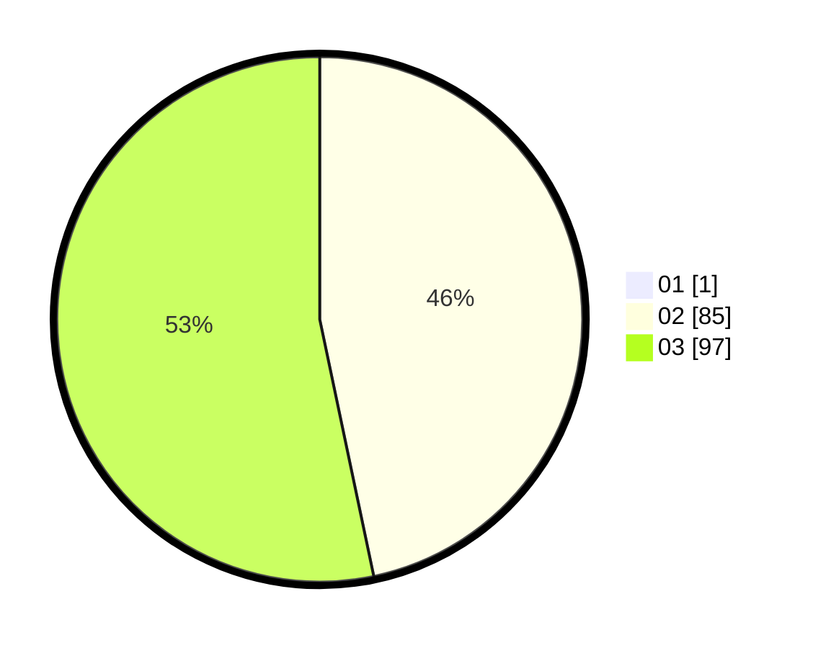

# Hasil

Hasil perolehan suara paslon dapat dilihat pada file paslon-01.txt, paslon-02.txt, dan paslon-03.txt.

Jika tidak ada, artinya data tersebut belum ada pada SIREKAP.

## Perolehan Suara

 * Paslon 01: **1**.
 * Paslon 02: **85**.
 * Paslon 03: **97**.

## Foto C Plano

https://sirekap-obj-formc.kpu.go.id/43b0/pemilu/ppwp/31/73/02/10/04/3173021004097-20240214-202427--0fcc4cd4-1080-444c-87f4-4ac5f1ef72c7.jpg

https://sirekap-obj-formc.kpu.go.id/43b0/pemilu/ppwp/31/73/02/10/04/3173021004097-20240214-193739--defcc1a9-c327-4cd0-9862-fc2994150bb6.jpg

https://sirekap-obj-formc.kpu.go.id/43b0/pemilu/ppwp/31/73/02/10/04/3173021004097-20240214-193838--87aa8335-e83a-4472-af9e-db8ef21710cf.jpg

## DATA PEMILIH TETAP

Jumlah pemilih dalam DPT: **244**.
 * L: **115**.
 * P: **129**.

## DATA PENGGUNA HAK PILIH

Jumlah pengguna hak pilih dalam DPT: **187**.
 * L: **90**.
 * P: **97**.

Jumlah pengguna hak pilih dalam DPTb: **1**.
 * L: **0**.
 * P: **1**.

Jumlah pengguna hak pilih dalam DPK: **0**.
 * L: **0**.
 * P: **0**.

Jumlah pengguna hak pilih: **188**.
 * L: **90**.
 * P: **98**.

## JUMLAH SUARA SAH DAN TIDAK SAH

JUMLAH SELURUH SUARA SAH: **183**.

JUMLAH SUARA TIDAK SAH: **6**.

JUMLAH SELURUH SUARA SAH DAN SUARA TIDAK SAH: **189**.
