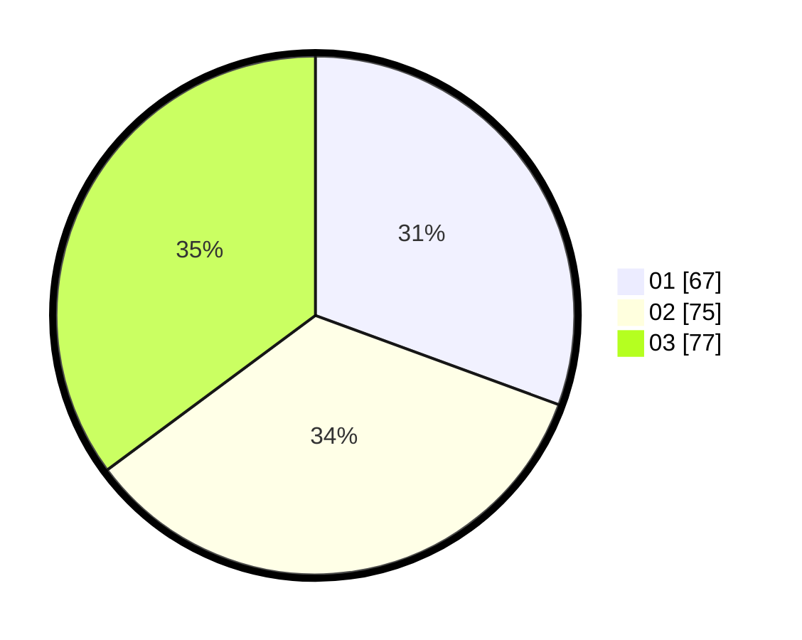

# Hasil

Hasil perolehan suara paslon dapat dilihat pada file paslon-01.txt, paslon-02.txt, dan paslon-03.txt.

Jika tidak ada, artinya data tersebut belum ada pada SIREKAP.

## Perolehan Suara

 * Paslon 01: **67**.
 * Paslon 02: **75**.
 * Paslon 03: **77**.

## Foto C Plano

https://sirekap-obj-formc.kpu.go.id/e068/pemilu/ppwp/31/73/02/10/04/3173021004102-20240214-214502--417f3cd8-890b-4032-91c7-f5f46c51d28e.jpg

https://sirekap-obj-formc.kpu.go.id/e068/pemilu/ppwp/31/73/02/10/04/3173021004102-20240214-214949--c125085c-0112-45b2-bbd2-8142c957c596.jpg

https://sirekap-obj-formc.kpu.go.id/e068/pemilu/ppwp/31/73/02/10/04/3173021004102-20240214-214612--16168cbd-a0ac-4269-8293-9966c31c27bb.jpg
