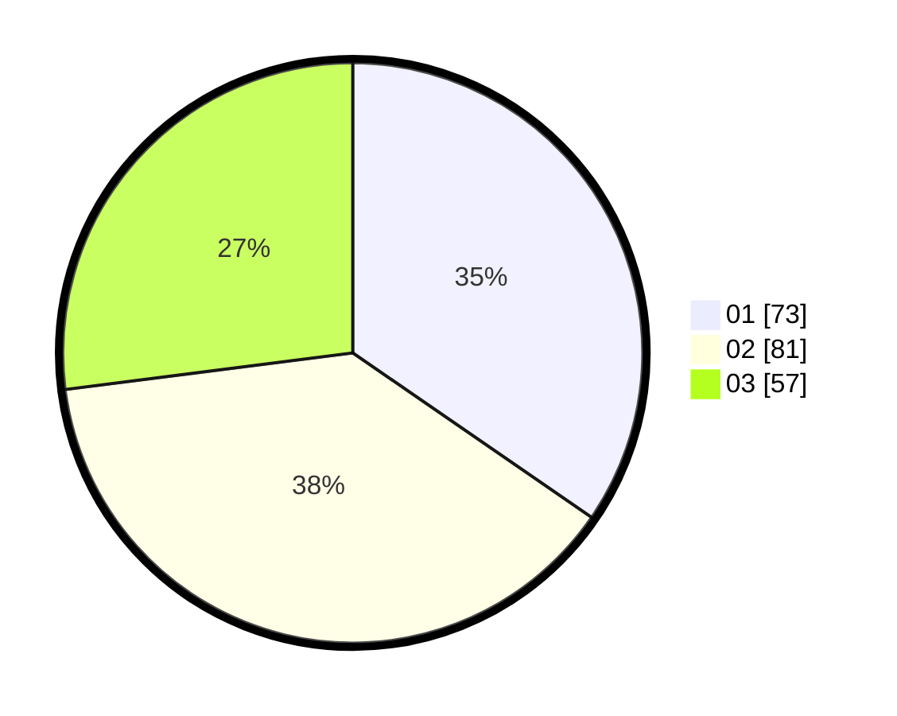

# Hasil

Hasil perolehan suara paslon dapat dilihat pada file paslon-01.txt, paslon-02.txt, dan paslon-03.txt.

Jika tidak ada, artinya data tersebut belum ada pada SIREKAP.

## Perolehan Suara

 * Paslon 01: **73**.
 * Paslon 02: **81**.
 * Paslon 03: **57**.

## Foto C Plano

https://sirekap-obj-formc.kpu.go.id/567f/pemilu/ppwp/31/73/02/10/04/3173021004103-20240214-212754--68b9f42d-8f75-4277-8367-a3b16ff67923.jpg

https://sirekap-obj-formc.kpu.go.id/567f/pemilu/ppwp/31/73/02/10/04/3173021004103-20240214-212838--6047de6c-5cde-4aa0-8070-c6fb1d43af0e.jpg

https://sirekap-obj-formc.kpu.go.id/567f/pemilu/ppwp/31/73/02/10/04/3173021004103-20240214-213052--3ba349fd-0284-438b-9108-dedba6637850.jpg
