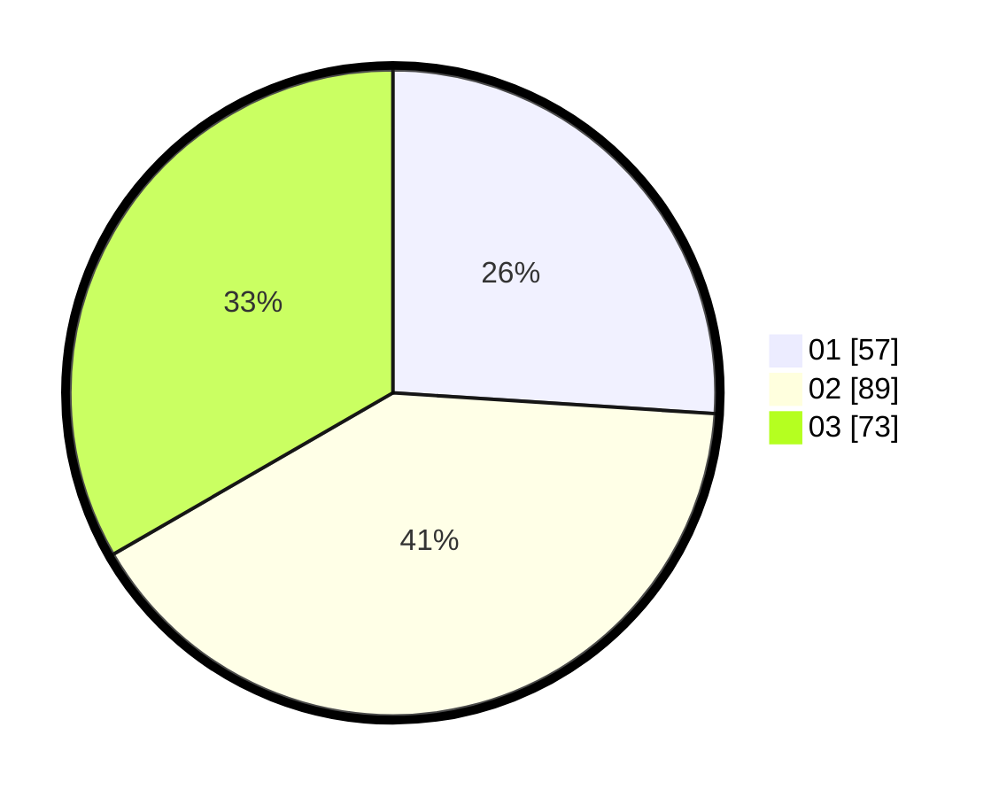

# Hasil

Hasil perolehan suara paslon dapat dilihat pada file paslon-01.txt, paslon-02.txt, dan paslon-03.txt.

Jika tidak ada, artinya data tersebut belum ada pada SIREKAP.

## Perolehan Suara

 * Paslon 01: **57**.
 * Paslon 02: **89**.
 * Paslon 03: **73**.

## Foto C Plano

https://sirekap-obj-formc.kpu.go.id/47c1/pemilu/ppwp/31/73/02/10/04/3173021004104-20240215-121413--afb96ed4-ac58-44ce-ab5e-8a93e4f7e1c0.jpg

https://sirekap-obj-formc.kpu.go.id/47c1/pemilu/ppwp/31/73/02/10/04/3173021004104-20240215-121417--13d785ad-8a94-4fba-87c7-f837a71e33df.jpg

https://sirekap-obj-formc.kpu.go.id/47c1/pemilu/ppwp/31/73/02/10/04/3173021004104-20240215-121420--c0ccc18d-6b2e-402f-9004-4bfdaf56bab3.jpg
