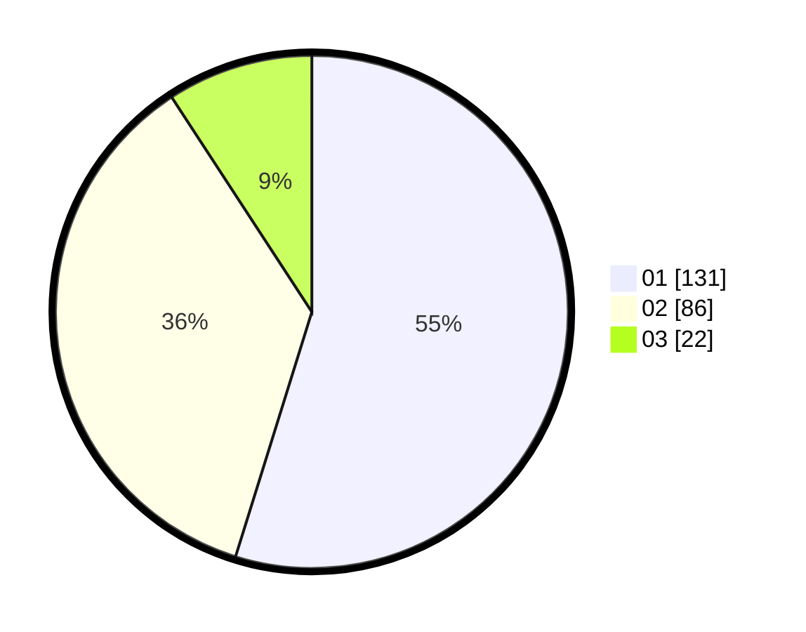

# Hasil

Hasil perolehan suara paslon dapat dilihat pada file paslon-01.txt, paslon-02.txt, dan paslon-03.txt.

Jika tidak ada, artinya data tersebut belum ada pada SIREKAP.

## Perolehan Suara

 * Paslon 01: **131**.
 * Paslon 02: **86**.
 * Paslon 03: **22**.

## Foto C Plano

https://sirekap-obj-formc.kpu.go.id/fd76/pemilu/ppwp/31/73/02/10/05/3173021005002-20240214-204428--e559dabf-bf40-4b2e-9a7c-b332ef4f9fa6.jpg

https://sirekap-obj-formc.kpu.go.id/fd76/pemilu/ppwp/31/73/02/10/05/3173021005002-20240214-201507--edf0c1e8-5619-406f-9111-751357748a6d.jpg

https://sirekap-obj-formc.kpu.go.id/fd76/pemilu/ppwp/31/73/02/10/05/3173021005002-20240214-201650--a3b1a727-f1d3-4912-abd8-c2fac2951684.jpg

## DATA PEMILIH TETAP

Jumlah pemilih dalam DPT: **275**.
 * L: **137**.
 * P: **138**.

## DATA PENGGUNA HAK PILIH

Jumlah pengguna hak pilih dalam DPT: **228**.
 * L: **114**.
 * P: **114**.

Jumlah pengguna hak pilih dalam DPTb: **16**.
 * L: **5**.
 * P: **11**.

Jumlah pengguna hak pilih dalam DPK: **1**.
 * L: **0**.
 * P: **1**.

Jumlah pengguna hak pilih: **245**.
 * L: **119**.
 * P: **126**.

## JUMLAH SUARA SAH DAN TIDAK SAH

JUMLAH SELURUH SUARA SAH: **239**.

JUMLAH SUARA TIDAK SAH: **6**.

JUMLAH SELURUH SUARA SAH DAN SUARA TIDAK SAH: **245**.
