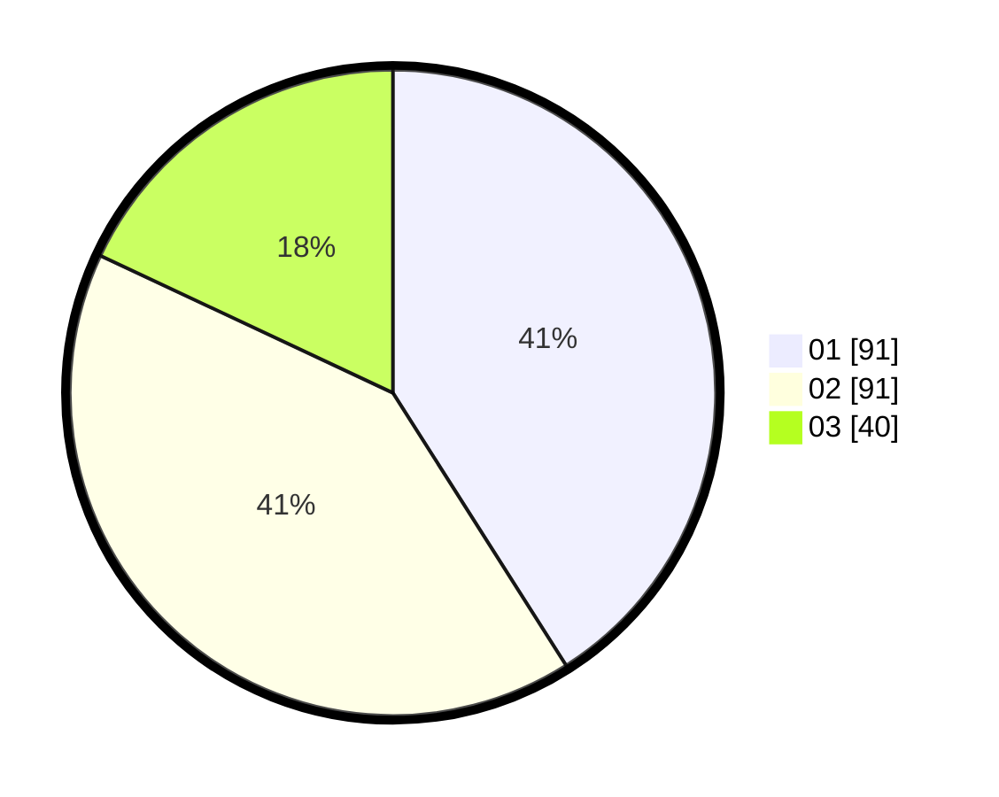

# Hasil

Hasil perolehan suara paslon dapat dilihat pada file paslon-01.txt, paslon-02.txt, dan paslon-03.txt.

Jika tidak ada, artinya data tersebut belum ada pada SIREKAP.

## Perolehan Suara

 * Paslon 01: **91**.
 * Paslon 02: **91**.
 * Paslon 03: **40**.

## Foto C Plano

https://sirekap-obj-formc.kpu.go.id/90d2/pemilu/ppwp/31/73/02/10/05/3173021005005-20240214-223930--5f2c29d6-bead-468a-9b29-00751dc5e8c7.jpg

https://sirekap-obj-formc.kpu.go.id/90d2/pemilu/ppwp/31/73/02/10/05/3173021005005-20240214-224015--84794131-48ca-4b9d-b0b1-880ba9883dbe.jpg

https://sirekap-obj-formc.kpu.go.id/90d2/pemilu/ppwp/31/73/02/10/05/3173021005005-20240214-224102--31d28ac9-c8e2-46a4-ba85-f29b128d85c1.jpg

## DATA PEMILIH TETAP

Jumlah pemilih dalam DPT: **276**.
 * L: **132**.
 * P: **144**.

## DATA PENGGUNA HAK PILIH

Jumlah pengguna hak pilih dalam DPT: **209**.
 * L: **96**.
 * P: **113**.

Jumlah pengguna hak pilih dalam DPTb: **10**.
 * L: **3**.
 * P: **7**.

Jumlah pengguna hak pilih dalam DPK: **6**.
 * L: **4**.
 * P: **2**.

Jumlah pengguna hak pilih: **225**.
 * L: **103**.
 * P: **122**.

## JUMLAH SUARA SAH DAN TIDAK SAH

JUMLAH SELURUH SUARA SAH: **222**.

JUMLAH SUARA TIDAK SAH: **3**.

JUMLAH SELURUH SUARA SAH DAN SUARA TIDAK SAH: **225**.
