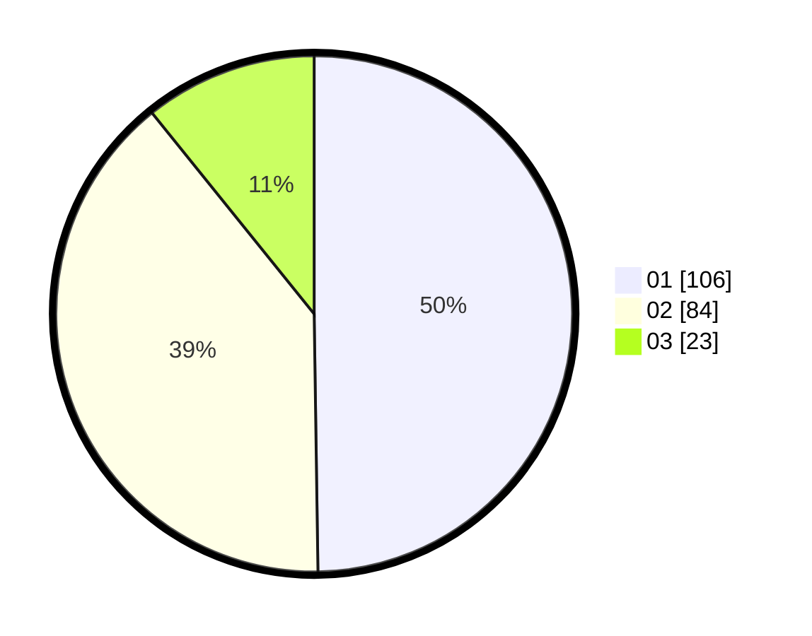

# Hasil

Hasil perolehan suara paslon dapat dilihat pada file paslon-01.txt, paslon-02.txt, dan paslon-03.txt.

Jika tidak ada, artinya data tersebut belum ada pada SIREKAP.

## Perolehan Suara

 * Paslon 01: **106**.
 * Paslon 02: **84**.
 * Paslon 03: **23**.

## Foto C Plano

https://sirekap-obj-formc.kpu.go.id/d871/pemilu/ppwp/31/73/02/10/05/3173021005007-20240214-235705--174cc2a0-a598-4c15-9b85-455bafce171d.jpg

https://sirekap-obj-formc.kpu.go.id/d871/pemilu/ppwp/31/73/02/10/05/3173021005007-20240214-235852--7847d3ff-0780-4a0c-80e2-8fb759b7e9bc.jpg

https://sirekap-obj-formc.kpu.go.id/d871/pemilu/ppwp/31/73/02/10/05/3173021005007-20240214-235851--b5ea9787-0dbb-4b7a-be87-28cbd96f83a5.jpg

## DATA PEMILIH TETAP

Jumlah pemilih dalam DPT: **276**.
 * L: **138**.
 * P: **138**.

## DATA PENGGUNA HAK PILIH

Jumlah pengguna hak pilih dalam DPT: **223**.
 * L: **108**.
 * P: **115**.

Jumlah pengguna hak pilih dalam DPTb: **5**.
 * L: **1**.
 * P: **4**.

Jumlah pengguna hak pilih dalam DPK: **2**.
 * L: **2**.
 * P: **0**.

Jumlah pengguna hak pilih: **230**.
 * L: **111**.
 * P: **119**.

## JUMLAH SUARA SAH DAN TIDAK SAH

JUMLAH SELURUH SUARA SAH: **223**.

JUMLAH SUARA TIDAK SAH: **7**.

JUMLAH SELURUH SUARA SAH DAN SUARA TIDAK SAH: **230**.
