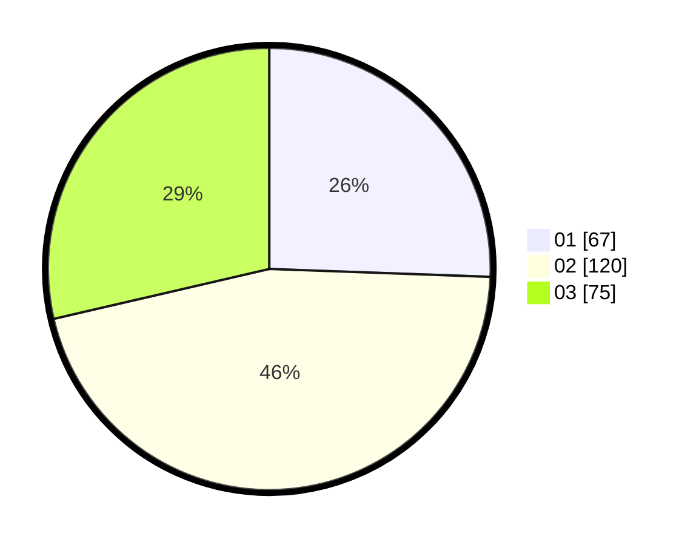

# Hasil

Hasil perolehan suara paslon dapat dilihat pada file paslon-01.txt, paslon-02.txt, dan paslon-03.txt.

Jika tidak ada, artinya data tersebut belum ada pada SIREKAP.

## Perolehan Suara

 * Paslon 01: **67**.
 * Paslon 02: **120**.
 * Paslon 03: **75**.

## Foto C Plano

https://sirekap-obj-formc.kpu.go.id/b56a/pemilu/ppwp/31/73/02/10/05/3173021005013-20240214-234043--c0ecc2ab-3a9f-46af-b442-dd14607d00b5.jpg

https://sirekap-obj-formc.kpu.go.id/b56a/pemilu/ppwp/31/73/02/10/05/3173021005013-20240214-234141--44a06184-6184-4ba1-9e6f-9ac582c7814a.jpg

https://sirekap-obj-formc.kpu.go.id/b56a/pemilu/ppwp/31/73/02/10/05/3173021005013-20240214-194058--f10054f9-35f7-4a38-a2bc-b4ac96cc7a0d.jpg

## DATA PEMILIH TETAP

Jumlah pemilih dalam DPT: **258**.
 * L: **114**.
 * P: **144**.

## DATA PENGGUNA HAK PILIH

Jumlah pengguna hak pilih dalam DPT: **181**.
 * L: **78**.
 * P: **103**.

Jumlah pengguna hak pilih dalam DPTb: **54**.
 * L: **27**.
 * P: **27**.

Jumlah pengguna hak pilih dalam DPK: **29**.
 * L: **15**.
 * P: **14**.

Jumlah pengguna hak pilih: **264**.
 * L: **120**.
 * P: **144**.

## JUMLAH SUARA SAH DAN TIDAK SAH

JUMLAH SELURUH SUARA SAH: **262**.

JUMLAH SUARA TIDAK SAH: **2**.

JUMLAH SELURUH SUARA SAH DAN SUARA TIDAK SAH: **264**.
