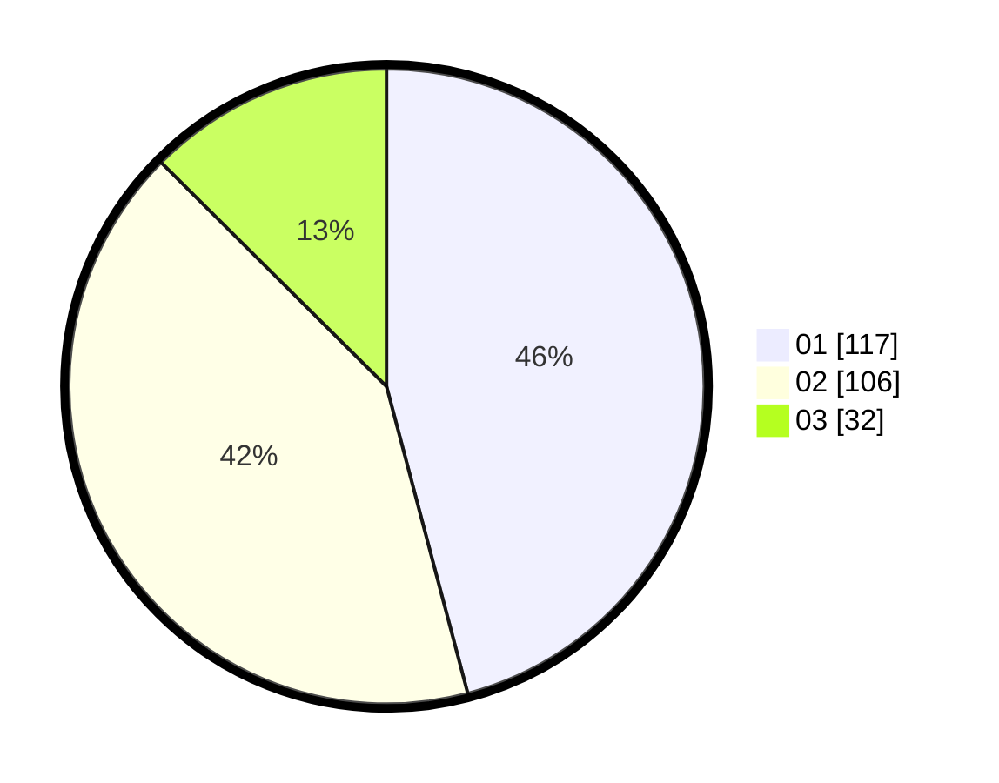

# Hasil

Hasil perolehan suara paslon dapat dilihat pada file paslon-01.txt, paslon-02.txt, dan paslon-03.txt.

Jika tidak ada, artinya data tersebut belum ada pada SIREKAP.

## Perolehan Suara

 * Paslon 01: **117**.
 * Paslon 02: **106**.
 * Paslon 03: **32**.

## Foto C Plano

https://sirekap-obj-formc.kpu.go.id/ebeb/pemilu/ppwp/31/73/02/10/05/3173021005016-20240214-232226--dd673dcb-bf4e-4308-9567-c39fd82e145d.jpg

https://sirekap-obj-formc.kpu.go.id/ebeb/pemilu/ppwp/31/73/02/10/05/3173021005016-20240214-232409--212cb370-f50e-4a78-9b93-12c113fe061f.jpg

https://sirekap-obj-formc.kpu.go.id/ebeb/pemilu/ppwp/31/73/02/10/05/3173021005016-20240214-232554--a11df18f-8314-4b19-ae28-543129e2cae4.jpg
