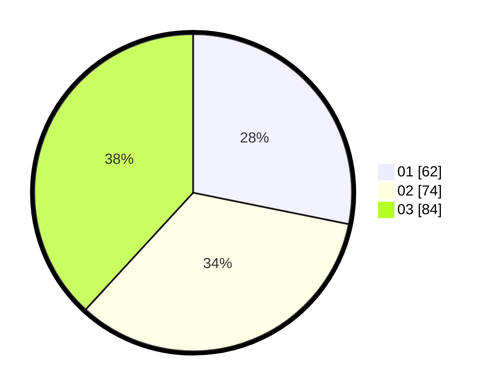

# Hasil

Hasil perolehan suara paslon dapat dilihat pada file paslon-01.txt, paslon-02.txt, dan paslon-03.txt.

Jika tidak ada, artinya data tersebut belum ada pada SIREKAP.

## Perolehan Suara

 * Paslon 01: **62**.
 * Paslon 02: **74**.
 * Paslon 03: **84**.

## Foto C Plano

https://sirekap-obj-formc.kpu.go.id/b03d/pemilu/ppwp/31/73/02/10/05/3173021005019-20240214-155511--06bffb0c-655b-49a3-a9e9-1f93e5c56b0d.jpg

https://sirekap-obj-formc.kpu.go.id/b03d/pemilu/ppwp/31/73/02/10/05/3173021005019-20240214-155454--0cda3a62-cb89-4862-8778-a7d4fe4d0122.jpg

https://sirekap-obj-formc.kpu.go.id/b03d/pemilu/ppwp/31/73/02/10/05/3173021005019-20240214-155433--112a0ca2-65d3-44d2-a531-de38d1bb7a3c.jpg
