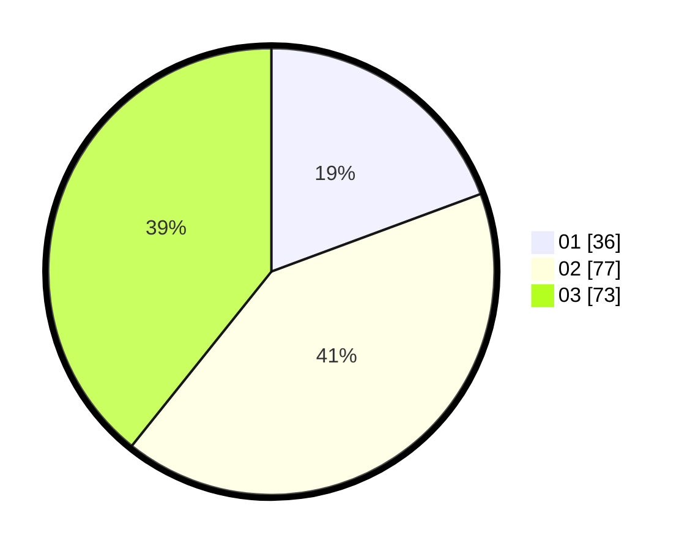

# Hasil

Hasil perolehan suara paslon dapat dilihat pada file paslon-01.txt, paslon-02.txt, dan paslon-03.txt.

Jika tidak ada, artinya data tersebut belum ada pada SIREKAP.

## Perolehan Suara

 * Paslon 01: **36**.
 * Paslon 02: **77**.
 * Paslon 03: **73**.

## Foto C Plano

https://sirekap-obj-formc.kpu.go.id/6181/pemilu/ppwp/31/73/02/10/05/3173021005038-20240215-155501--6186967c-40c0-4526-8ec3-4417c84f7440.jpg

https://sirekap-obj-formc.kpu.go.id/6181/pemilu/ppwp/31/73/02/10/05/3173021005038-20240215-155522--a6245f65-e824-4fc4-96ef-4d8f8be96342.jpg

https://sirekap-obj-formc.kpu.go.id/6181/pemilu/ppwp/31/73/02/10/05/3173021005038-20240215-155634--426aca57-cc82-4f48-9173-524009de255a.jpg

## DATA PEMILIH TETAP

Jumlah pemilih dalam DPT: **233**.
 * L: **110**.
 * P: **123**.

## DATA PENGGUNA HAK PILIH

Jumlah pengguna hak pilih dalam DPT: **181**.
 * L: **83**.
 * P: **98**.

Jumlah pengguna hak pilih dalam DPTb: **5**.
 * L: **3**.
 * P: **2**.

Jumlah pengguna hak pilih dalam DPK: **2**.
 * L: **2**.
 * P: **0**.

Jumlah pengguna hak pilih: **188**.
 * L: **88**.
 * P: **100**.

## JUMLAH SUARA SAH DAN TIDAK SAH

JUMLAH SELURUH SUARA SAH: **186**.

JUMLAH SUARA TIDAK SAH: **2**.

JUMLAH SELURUH SUARA SAH DAN SUARA TIDAK SAH: **188**.
