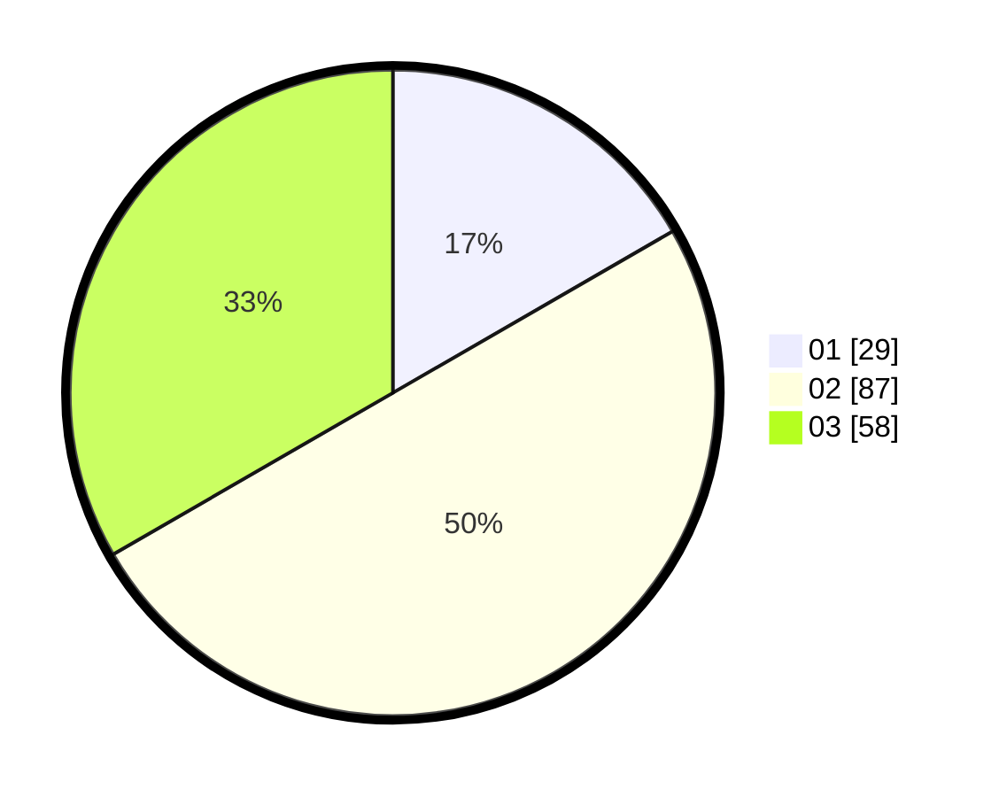

# Hasil

Hasil perolehan suara paslon dapat dilihat pada file paslon-01.txt, paslon-02.txt, dan paslon-03.txt.

Jika tidak ada, artinya data tersebut belum ada pada SIREKAP.

## Perolehan Suara

 * Paslon 01: **29**.
 * Paslon 02: **87**.
 * Paslon 03: **58**.

## Foto C Plano

https://sirekap-obj-formc.kpu.go.id/a057/pemilu/ppwp/31/73/02/10/05/3173021005042-20240214-192432--22ccf9e9-7333-4d0c-bbfb-9694229d45da.jpg

https://sirekap-obj-formc.kpu.go.id/a057/pemilu/ppwp/31/73/02/10/05/3173021005042-20240214-192241--4357ff71-4fba-4d14-b63a-c449acc737cb.jpg

https://sirekap-obj-formc.kpu.go.id/a057/pemilu/ppwp/31/73/02/10/05/3173021005042-20240214-192342--2d000afc-c561-4db4-bd99-850cf901308f.jpg

## DATA PEMILIH TETAP

Jumlah pemilih dalam DPT: **201**.
 * L: **95**.
 * P: **106**.

## DATA PENGGUNA HAK PILIH

Jumlah pengguna hak pilih dalam DPT: **145**.
 * L: **69**.
 * P: **76**.

Jumlah pengguna hak pilih dalam DPTb: **24**.
 * L: **10**.
 * P: **14**.

Jumlah pengguna hak pilih dalam DPK: **4**.
 * L: **3**.
 * P: **1**.

Jumlah pengguna hak pilih: **173**.
 * L: **82**.
 * P: **91**.

## JUMLAH SUARA SAH DAN TIDAK SAH

JUMLAH SELURUH SUARA SAH: **174**.

JUMLAH SUARA TIDAK SAH: **0**.

JUMLAH SELURUH SUARA SAH DAN SUARA TIDAK SAH: **174**.
