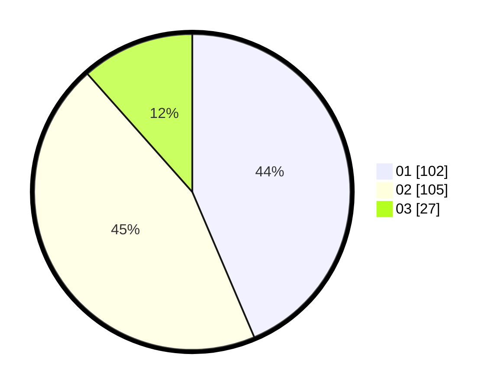

# Hasil

Hasil perolehan suara paslon dapat dilihat pada file paslon-01.txt, paslon-02.txt, dan paslon-03.txt.

Jika tidak ada, artinya data tersebut belum ada pada SIREKAP.

## Perolehan Suara

 * Paslon 01: **102**.
 * Paslon 02: **105**.
 * Paslon 03: **27**.

## Foto C Plano

https://sirekap-obj-formc.kpu.go.id/7913/pemilu/ppwp/31/73/02/10/05/3173021005047-20240214-213705--5ebd5982-52df-4067-80b4-707b2c11210c.jpg

https://sirekap-obj-formc.kpu.go.id/7913/pemilu/ppwp/31/73/02/10/05/3173021005047-20240214-213826--ffeb2850-ca10-45c5-a3aa-2ab63112ccb0.jpg

https://sirekap-obj-formc.kpu.go.id/7913/pemilu/ppwp/31/73/02/10/05/3173021005047-20240214-213952--2b11edd7-ca1f-4562-99df-d57f59ce05c9.jpg
