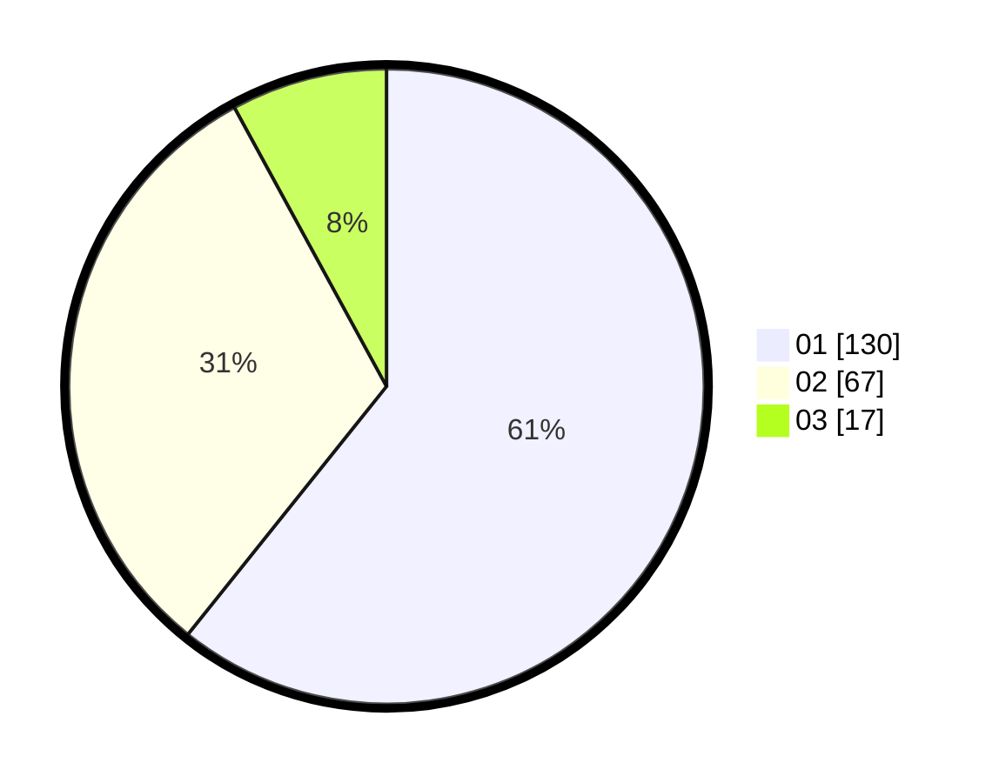

# Hasil

Hasil perolehan suara paslon dapat dilihat pada file paslon-01.txt, paslon-02.txt, dan paslon-03.txt.

Jika tidak ada, artinya data tersebut belum ada pada SIREKAP.

## Perolehan Suara

 * Paslon 01: **130**.
 * Paslon 02: **67**.
 * Paslon 03: **17**.

## Foto C Plano

https://sirekap-obj-formc.kpu.go.id/70b1/pemilu/ppwp/31/73/02/10/05/3173021005048-20240215-002736--b529cc75-4e5d-4b21-8f57-13d4d1ace3b2.jpg

https://sirekap-obj-formc.kpu.go.id/70b1/pemilu/ppwp/31/73/02/10/05/3173021005048-20240215-002836--ffbc5fb5-3659-425e-8920-26cc231638ca.jpg

https://sirekap-obj-formc.kpu.go.id/70b1/pemilu/ppwp/31/73/02/10/05/3173021005048-20240215-002924--2ccb7703-bf4c-4458-ab0f-e2d60c978b35.jpg

## DATA PEMILIH TETAP

Jumlah pemilih dalam DPT: **281**.
 * L: **134**.
 * P: **147**.

## DATA PENGGUNA HAK PILIH

Jumlah pengguna hak pilih dalam DPT: **209**.
 * L: **101**.
 * P: **108**.

Jumlah pengguna hak pilih dalam DPTb: **4**.
 * L: **1**.
 * P: **3**.

Jumlah pengguna hak pilih dalam DPK: **3**.
 * L: **1**.
 * P: **2**.

Jumlah pengguna hak pilih: **216**.
 * L: **103**.
 * P: **113**.

## JUMLAH SUARA SAH DAN TIDAK SAH

JUMLAH SELURUH SUARA SAH: **214**.

JUMLAH SUARA TIDAK SAH: **2**.

JUMLAH SELURUH SUARA SAH DAN SUARA TIDAK SAH: **216**.
