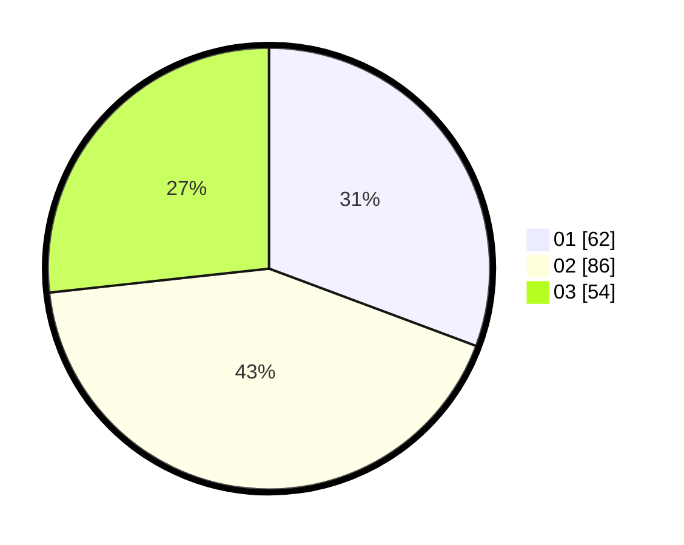

# Hasil

Hasil perolehan suara paslon dapat dilihat pada file paslon-01.txt, paslon-02.txt, dan paslon-03.txt.

Jika tidak ada, artinya data tersebut belum ada pada SIREKAP.

## Perolehan Suara

 * Paslon 01: **62**.
 * Paslon 02: **86**.
 * Paslon 03: **54**.

## Foto C Plano

https://sirekap-obj-formc.kpu.go.id/65d1/pemilu/ppwp/31/73/02/10/05/3173021005055-20240216-003920--213c4d2e-8cef-4914-882a-7b3427aa9ccf.jpg

https://sirekap-obj-formc.kpu.go.id/65d1/pemilu/ppwp/31/73/02/10/05/3173021005055-20240216-003921--25467b1a-a62e-490e-bcfa-21fcd099da26.jpg

https://sirekap-obj-formc.kpu.go.id/65d1/pemilu/ppwp/31/73/02/10/05/3173021005055-20240216-003920--56701ed3-0327-4edf-a0ee-d9f7441ca9b2.jpg

## DATA PEMILIH TETAP

Jumlah pemilih dalam DPT: **283**.
 * L: **128**.
 * P: **155**.

## DATA PENGGUNA HAK PILIH

Jumlah pengguna hak pilih dalam DPT: **188**.
 * L: **90**.
 * P: **98**.

Jumlah pengguna hak pilih dalam DPTb: **8**.
 * L: **4**.
 * P: **4**.

Jumlah pengguna hak pilih dalam DPK: **6**.
 * L: **3**.
 * P: **3**.

Jumlah pengguna hak pilih: **202**.
 * L: **97**.
 * P: **105**.

## JUMLAH SUARA SAH DAN TIDAK SAH

JUMLAH SELURUH SUARA SAH: **202**.

JUMLAH SUARA TIDAK SAH: **0**.

JUMLAH SELURUH SUARA SAH DAN SUARA TIDAK SAH: **202**.
