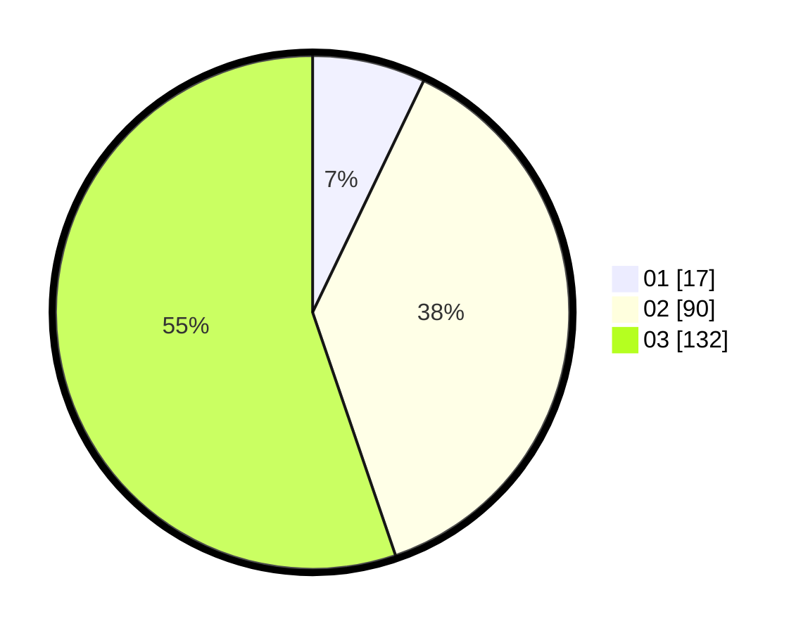

# Hasil

Hasil perolehan suara paslon dapat dilihat pada file paslon-01.txt, paslon-02.txt, dan paslon-03.txt.

Jika tidak ada, artinya data tersebut belum ada pada SIREKAP.

## Perolehan Suara

 * Paslon 01: **17**.
 * Paslon 02: **90**.
 * Paslon 03: **132**.

## Foto C Plano

https://sirekap-obj-formc.kpu.go.id/587c/pemilu/ppwp/31/73/02/10/05/3173021005057-20240215-022813--f75a83af-4e84-4588-898a-51e0913dc0fd.jpg

https://sirekap-obj-formc.kpu.go.id/587c/pemilu/ppwp/31/73/02/10/05/3173021005057-20240214-233442--56c1e175-a13f-474c-8663-60a75e459435.jpg

https://sirekap-obj-formc.kpu.go.id/587c/pemilu/ppwp/31/73/02/10/05/3173021005057-20240215-022912--69797cd3-1039-42bb-bc65-3f8ae35826bd.jpg
