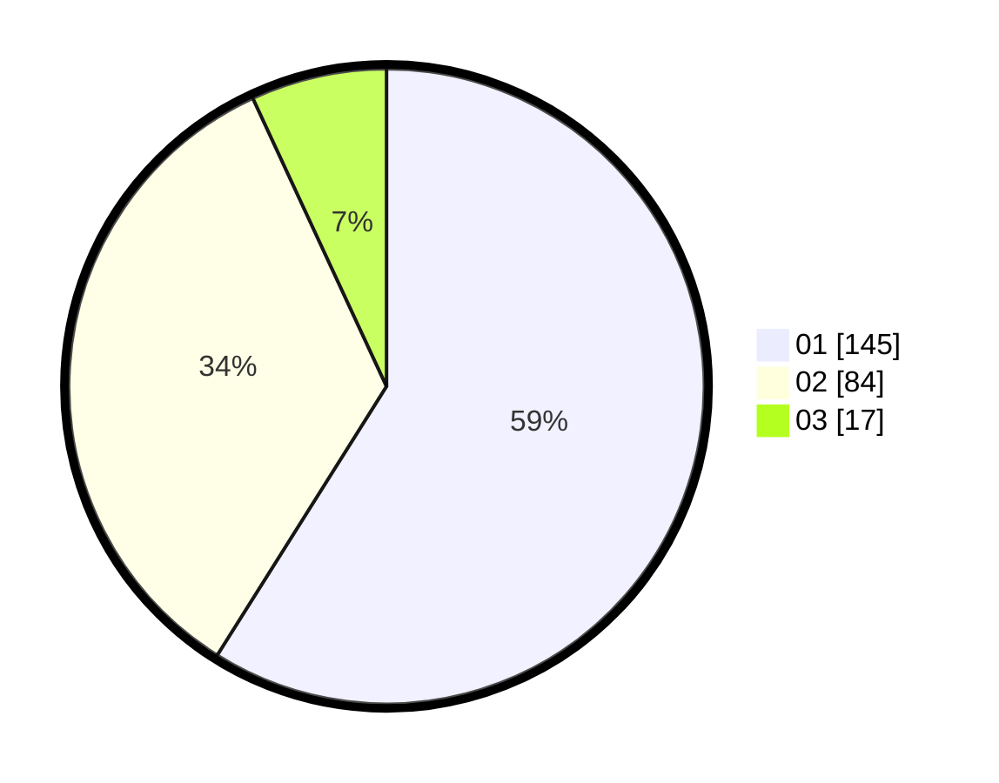

# Hasil

Hasil perolehan suara paslon dapat dilihat pada file paslon-01.txt, paslon-02.txt, dan paslon-03.txt.

Jika tidak ada, artinya data tersebut belum ada pada SIREKAP.

## Perolehan Suara

 * Paslon 01: **145**.
 * Paslon 02: **84**.
 * Paslon 03: **17**.

## Foto C Plano

https://sirekap-obj-formc.kpu.go.id/d101/pemilu/ppwp/31/73/02/10/05/3173021005064-20240214-232044--5465db3b-3254-4dc8-8491-16c1b6aeb4f6.jpg

https://sirekap-obj-formc.kpu.go.id/d101/pemilu/ppwp/31/73/02/10/05/3173021005064-20240214-231716--e305db40-b0a7-4b09-a2fa-393844bc6ffd.jpg

https://sirekap-obj-formc.kpu.go.id/d101/pemilu/ppwp/31/73/02/10/05/3173021005064-20240214-231916--3eaee28a-8c28-4f9a-a66c-d970ff0f4b05.jpg
