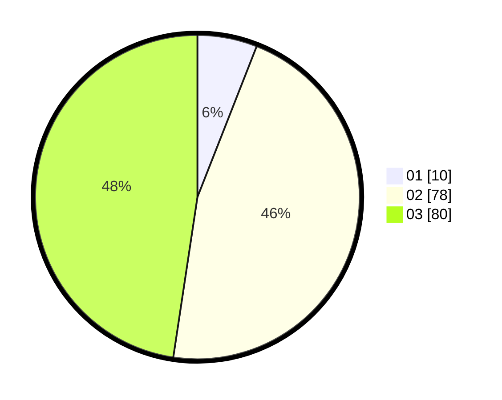

# Hasil

Hasil perolehan suara paslon dapat dilihat pada file paslon-01.txt, paslon-02.txt, dan paslon-03.txt.

Jika tidak ada, artinya data tersebut belum ada pada SIREKAP.

## Perolehan Suara

 * Paslon 01: **10**.
 * Paslon 02: **78**.
 * Paslon 03: **80**.

## Foto C Plano

https://sirekap-obj-formc.kpu.go.id/16b4/pemilu/ppwp/31/73/02/10/05/3173021005073-20240214-213441--549a32bf-3df6-44d9-ac1f-59ffcef59797.jpg

https://sirekap-obj-formc.kpu.go.id/16b4/pemilu/ppwp/31/73/02/10/05/3173021005073-20240214-213445--2ead409f-6b40-4832-a8e7-a0bdeafc685f.jpg

https://sirekap-obj-formc.kpu.go.id/16b4/pemilu/ppwp/31/73/02/10/05/3173021005073-20240214-213450--b3c0a297-03a7-4879-8bef-8fe2c60c6936.jpg
