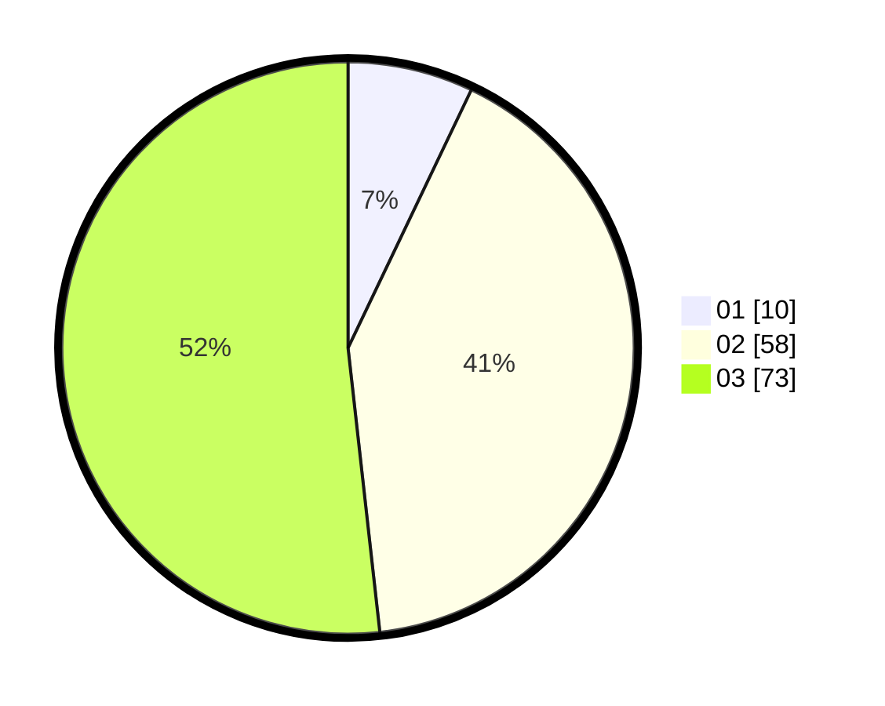

# Hasil

Hasil perolehan suara paslon dapat dilihat pada file paslon-01.txt, paslon-02.txt, dan paslon-03.txt.

Jika tidak ada, artinya data tersebut belum ada pada SIREKAP.

## Perolehan Suara

 * Paslon 01: **10**.
 * Paslon 02: **58**.
 * Paslon 03: **73**.

## Foto C Plano

https://sirekap-obj-formc.kpu.go.id/75ec/pemilu/ppwp/31/73/02/10/05/3173021005075-20240216-080135--8844ac34-006c-45cd-8b31-18884e6e7fda.jpg

https://sirekap-obj-formc.kpu.go.id/75ec/pemilu/ppwp/31/73/02/10/05/3173021005075-20240216-080143--673a17cf-0c03-4c0d-bc62-44ba16f46d68.jpg

https://sirekap-obj-formc.kpu.go.id/75ec/pemilu/ppwp/31/73/02/10/05/3173021005075-20240216-080152--5ca4a570-97a1-4232-b863-942ae2f31ae9.jpg
