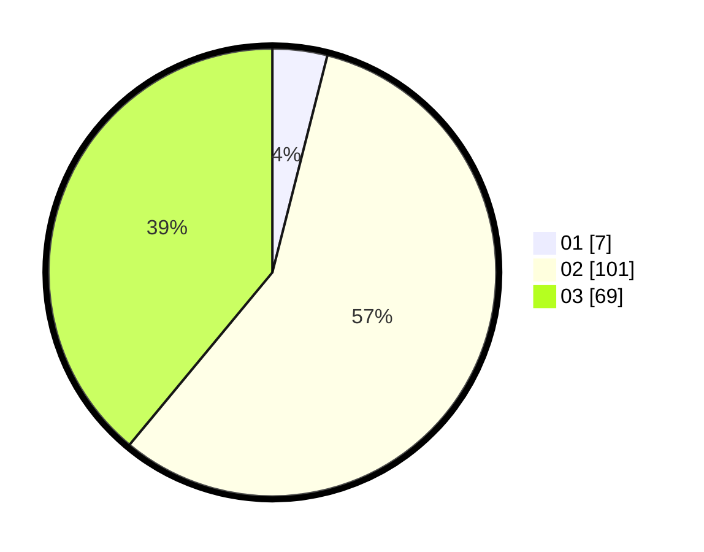

# Hasil

Hasil perolehan suara paslon dapat dilihat pada file paslon-01.txt, paslon-02.txt, dan paslon-03.txt.

Jika tidak ada, artinya data tersebut belum ada pada SIREKAP.

## Perolehan Suara

 * Paslon 01: **7**.
 * Paslon 02: **101**.
 * Paslon 03: **69**.

## Foto C Plano

https://sirekap-obj-formc.kpu.go.id/2fd4/pemilu/ppwp/31/73/02/10/05/3173021005084-20240215-081922--9fcfbd7a-4f62-4af1-bf14-f49fd2ec63dd.jpg

https://sirekap-obj-formc.kpu.go.id/2fd4/pemilu/ppwp/31/73/02/10/05/3173021005084-20240215-081927--9e3976e5-cf03-489f-8064-048ab8e8171b.jpg

https://sirekap-obj-formc.kpu.go.id/2fd4/pemilu/ppwp/31/73/02/10/05/3173021005084-20240215-081931--8dfd2020-f657-41ac-9167-71900681166a.jpg
