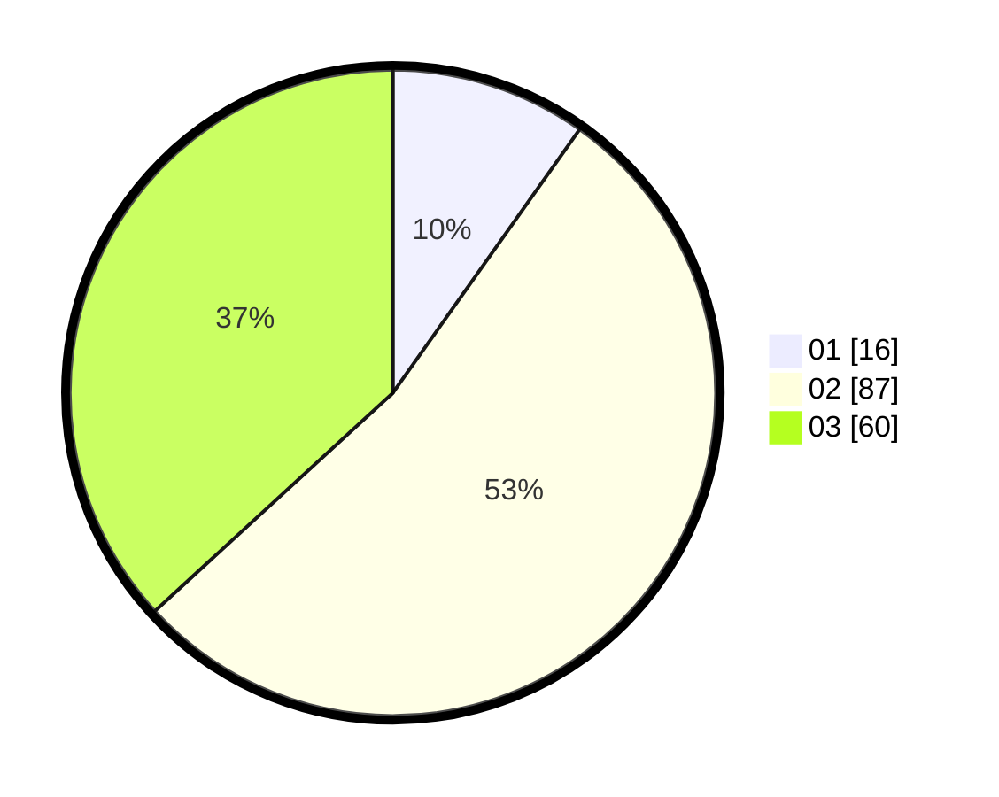

# Hasil

Hasil perolehan suara paslon dapat dilihat pada file paslon-01.txt, paslon-02.txt, dan paslon-03.txt.

Jika tidak ada, artinya data tersebut belum ada pada SIREKAP.

## Perolehan Suara

 * Paslon 01: **16**.
 * Paslon 02: **87**.
 * Paslon 03: **60**.

## Foto C Plano

https://sirekap-obj-formc.kpu.go.id/c235/pemilu/ppwp/31/73/02/10/06/3173021006003-20240218-183305--cc2d7de6-9357-42a8-b1ee-bbeea2aac203.jpg

https://sirekap-obj-formc.kpu.go.id/c235/pemilu/ppwp/31/73/02/10/06/3173021006003-20240218-183315--3f57dee5-244e-4516-9567-16900cb3c590.jpg

https://sirekap-obj-formc.kpu.go.id/c235/pemilu/ppwp/31/73/02/10/06/3173021006003-20240218-183323--545bc3c6-65c6-4cee-a9ae-11b70f285e76.jpg

## DATA PEMILIH TETAP

Jumlah pemilih dalam DPT: **164**.
 * L: **82**.
 * P: **22**.

## DATA PENGGUNA HAK PILIH

Jumlah pengguna hak pilih dalam DPT: **461**.
 * L: **89**.
 * P: **81**.

Jumlah pengguna hak pilih dalam DPTb: **63**.
 * L: **2**.
 * P: **91**.

Jumlah pengguna hak pilih dalam DPK: **0**.
 * L: **0**.
 * P: **0**.

Jumlah pengguna hak pilih: **164**.
 * L: **82**.
 * P: **82**.

## JUMLAH SUARA SAH DAN TIDAK SAH

JUMLAH SELURUH SUARA SAH: **163**.

JUMLAH SUARA TIDAK SAH: **1**.

JUMLAH SELURUH SUARA SAH DAN SUARA TIDAK SAH: **164**.
