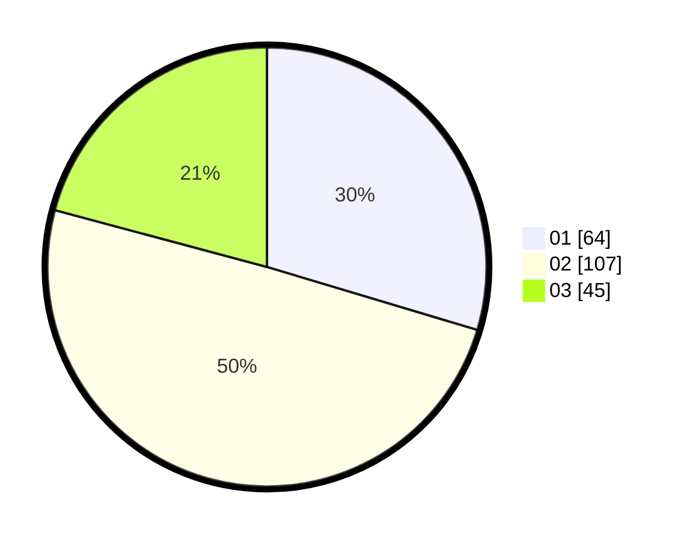

# Hasil

Hasil perolehan suara paslon dapat dilihat pada file paslon-01.txt, paslon-02.txt, dan paslon-03.txt.

Jika tidak ada, artinya data tersebut belum ada pada SIREKAP.

## Perolehan Suara

 * Paslon 01: **64**.
 * Paslon 02: **107**.
 * Paslon 03: **45**.

## Foto C Plano

https://sirekap-obj-formc.kpu.go.id/8602/pemilu/ppwp/31/73/02/10/06/3173021006004-20240214-203712--bf775214-8023-46f8-9f56-1bd1dc6b6ae1.jpg

https://sirekap-obj-formc.kpu.go.id/8602/pemilu/ppwp/31/73/02/10/06/3173021006004-20240214-203952--ba139a49-89df-4e89-a9a2-00bf9506be60.jpg

https://sirekap-obj-formc.kpu.go.id/8602/pemilu/ppwp/31/73/02/10/06/3173021006004-20240214-204148--afcb608d-49ab-4080-9f08-defa6056a5c0.jpg
