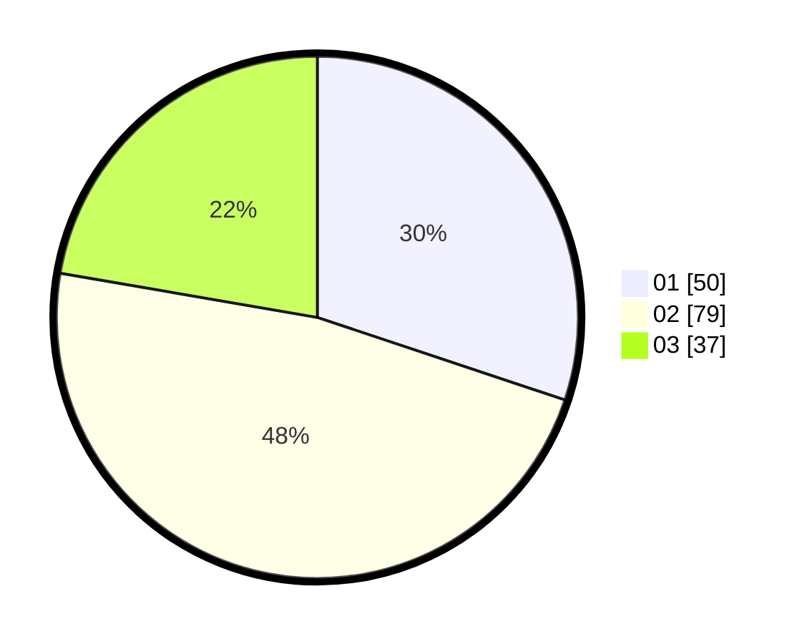

# Hasil

Hasil perolehan suara paslon dapat dilihat pada file paslon-01.txt, paslon-02.txt, dan paslon-03.txt.

Jika tidak ada, artinya data tersebut belum ada pada SIREKAP.

## Perolehan Suara

 * Paslon 01: **50**.
 * Paslon 02: **79**.
 * Paslon 03: **37**.

## Foto C Plano

https://sirekap-obj-formc.kpu.go.id/6d39/pemilu/ppwp/31/73/02/10/06/3173021006006-20240214-223934--7979c56c-f6fc-4dbc-98ab-a3605d5fc6f6.jpg

https://sirekap-obj-formc.kpu.go.id/6d39/pemilu/ppwp/31/73/02/10/06/3173021006006-20240214-224040--383d6c24-234c-4142-accf-34b2a5e3202e.jpg

https://sirekap-obj-formc.kpu.go.id/6d39/pemilu/ppwp/31/73/02/10/06/3173021006006-20240214-224207--ed1426ce-0d0d-4dff-805d-47b4dd927f2b.jpg
