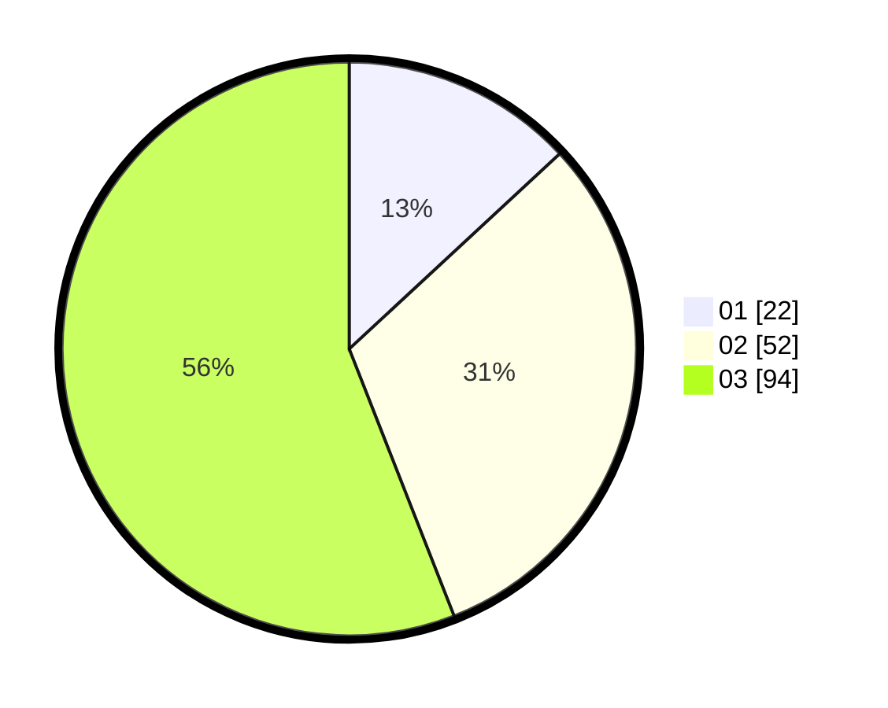

# Hasil

Hasil perolehan suara paslon dapat dilihat pada file paslon-01.txt, paslon-02.txt, dan paslon-03.txt.

Jika tidak ada, artinya data tersebut belum ada pada SIREKAP.

## Perolehan Suara

 * Paslon 01: **22**.
 * Paslon 02: **52**.
 * Paslon 03: **94**.

## Foto C Plano

https://sirekap-obj-formc.kpu.go.id/49b8/pemilu/ppwp/31/73/02/10/06/3173021006017-20240214-214134--73bb6a9b-4ba2-4b8d-843e-f08b03c49e86.jpg

https://sirekap-obj-formc.kpu.go.id/49b8/pemilu/ppwp/31/73/02/10/06/3173021006017-20240214-214256--b42273ab-9ce5-4f67-b317-21761a91b6fb.jpg

https://sirekap-obj-formc.kpu.go.id/49b8/pemilu/ppwp/31/73/02/10/06/3173021006017-20240214-214343--e386dc3a-5fea-418e-a0b1-96209261627d.jpg
