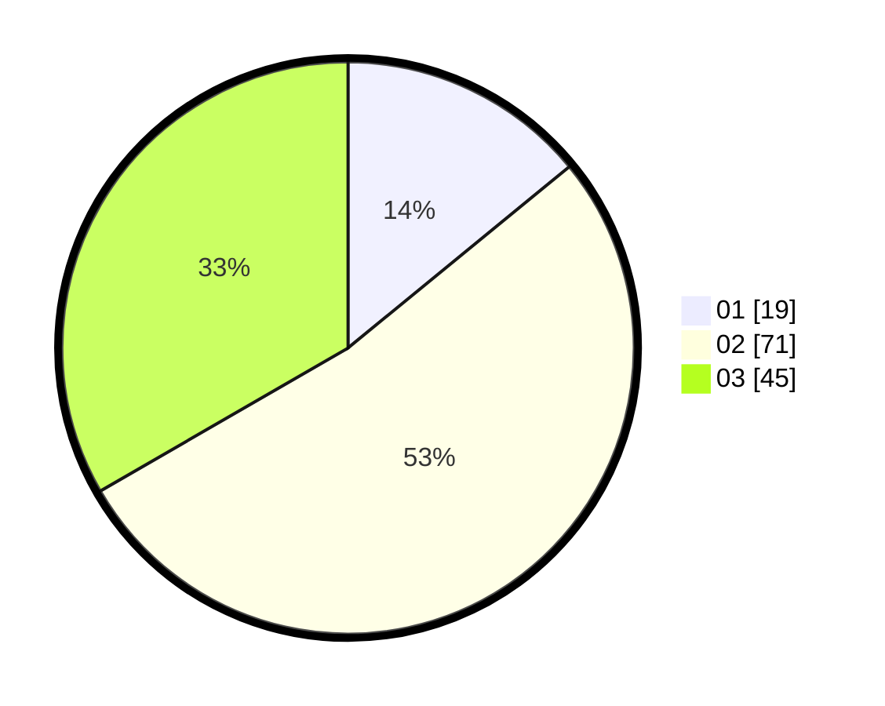

# Hasil

Hasil perolehan suara paslon dapat dilihat pada file paslon-01.txt, paslon-02.txt, dan paslon-03.txt.

Jika tidak ada, artinya data tersebut belum ada pada SIREKAP.

## Perolehan Suara

 * Paslon 01: **19**.
 * Paslon 02: **71**.
 * Paslon 03: **45**.

## Foto C Plano

https://sirekap-obj-formc.kpu.go.id/a6c2/pemilu/ppwp/31/73/02/10/06/3173021006019-20240215-002605--306f7b65-9ab6-42dc-8c89-7943afe11d4b.jpg

https://sirekap-obj-formc.kpu.go.id/a6c2/pemilu/ppwp/31/73/02/10/06/3173021006019-20240214-202617--6587f406-3d7d-4df4-95c9-b9e921c5f440.jpg
