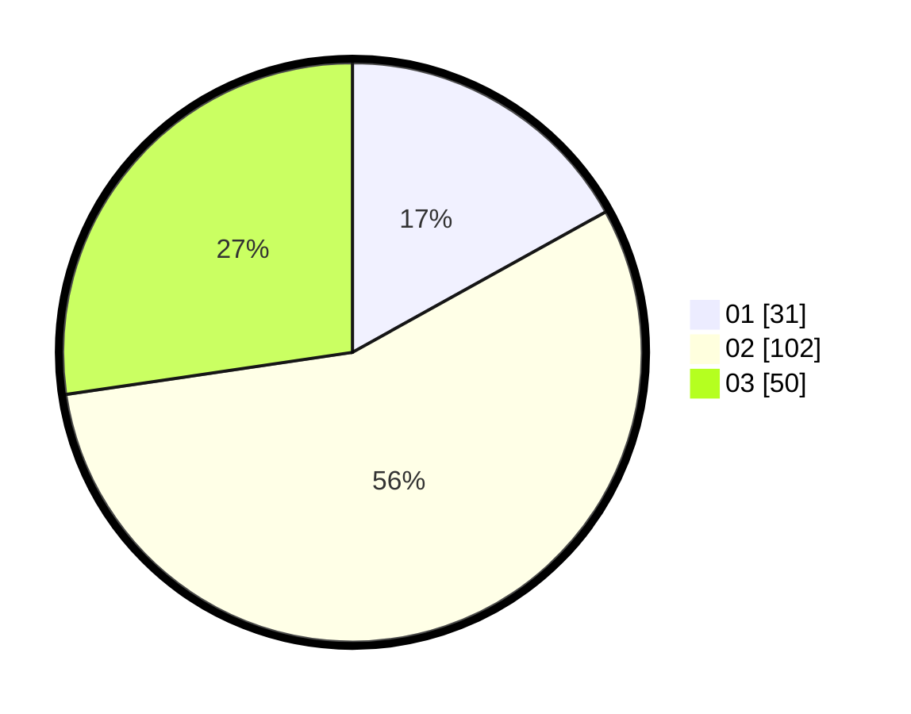

# Hasil

Hasil perolehan suara paslon dapat dilihat pada file paslon-01.txt, paslon-02.txt, dan paslon-03.txt.

Jika tidak ada, artinya data tersebut belum ada pada SIREKAP.

## Perolehan Suara

 * Paslon 01: **31**.
 * Paslon 02: **102**.
 * Paslon 03: **50**.

## Foto C Plano

https://sirekap-obj-formc.kpu.go.id/f781/pemilu/ppwp/31/73/02/10/06/3173021006021-20240214-215032--409e6a30-9c83-4a9b-8b8b-66f2c9a433c9.jpg

https://sirekap-obj-formc.kpu.go.id/f781/pemilu/ppwp/31/73/02/10/06/3173021006021-20240214-215158--815e526d-b679-4492-bd83-9edd0f2f2805.jpg

https://sirekap-obj-formc.kpu.go.id/f781/pemilu/ppwp/31/73/02/10/06/3173021006021-20240214-221155--fd337e81-0473-4a33-ac42-898a096d977d.jpg

## DATA PEMILIH TETAP

Jumlah pemilih dalam DPT: **268**.
 * L: **133**.
 * P: **135**.

## DATA PENGGUNA HAK PILIH

Jumlah pengguna hak pilih dalam DPT: **188**.
 * L: **89**.
 * P: **99**.

Jumlah pengguna hak pilih dalam DPTb: **0**.
 * L: **0**.
 * P: **0**.

Jumlah pengguna hak pilih dalam DPK: **0**.
 * L: **0**.
 * P: **0**.

Jumlah pengguna hak pilih: **188**.
 * L: **89**.
 * P: **99**.

## JUMLAH SUARA SAH DAN TIDAK SAH

JUMLAH SELURUH SUARA SAH: **183**.

JUMLAH SUARA TIDAK SAH: **5**.

JUMLAH SELURUH SUARA SAH DAN SUARA TIDAK SAH: **188**.
