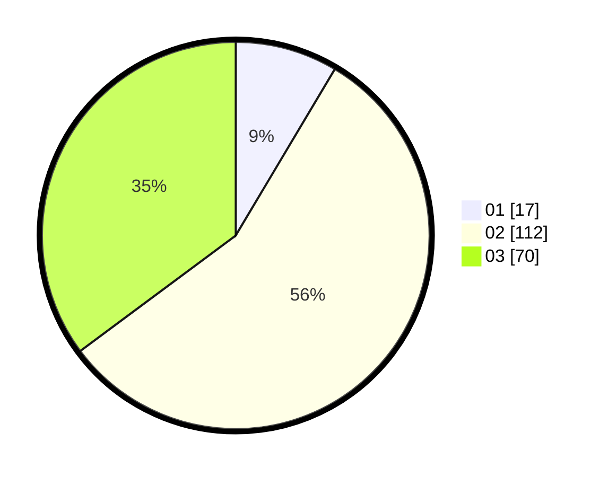

# Hasil

Hasil perolehan suara paslon dapat dilihat pada file paslon-01.txt, paslon-02.txt, dan paslon-03.txt.

Jika tidak ada, artinya data tersebut belum ada pada SIREKAP.

## Perolehan Suara

 * Paslon 01: **17**.
 * Paslon 02: **112**.
 * Paslon 03: **70**.

## Foto C Plano

https://sirekap-obj-formc.kpu.go.id/f08b/pemilu/ppwp/31/73/02/10/06/3173021006023-20240214-230719--8e907701-c67a-4d86-a863-ac45a0257d98.jpg

https://sirekap-obj-formc.kpu.go.id/f08b/pemilu/ppwp/31/73/02/10/06/3173021006023-20240214-231738--65a94681-eae9-49b7-aac6-6d7536b3c39d.jpg

https://sirekap-obj-formc.kpu.go.id/f08b/pemilu/ppwp/31/73/02/10/06/3173021006023-20240214-231817--8ac5c25b-19ed-4930-a7bc-e11f77ccebb6.jpg
