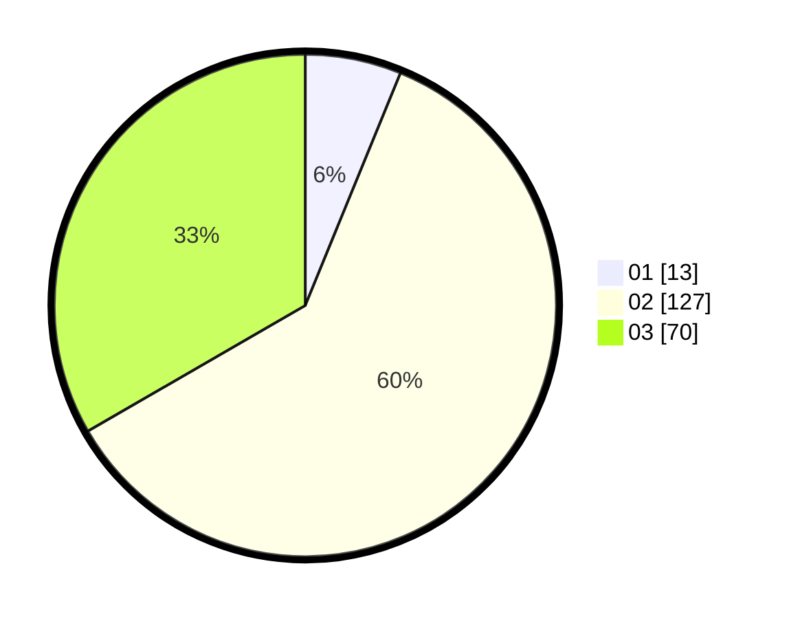

# Hasil

Hasil perolehan suara paslon dapat dilihat pada file paslon-01.txt, paslon-02.txt, dan paslon-03.txt.

Jika tidak ada, artinya data tersebut belum ada pada SIREKAP.

## Perolehan Suara

 * Paslon 01: **13**.
 * Paslon 02: **127**.
 * Paslon 03: **70**.

## Foto C Plano

https://sirekap-obj-formc.kpu.go.id/88a9/pemilu/ppwp/31/73/02/10/06/3173021006024-20240217-094531--d0d6f3b3-e044-4192-bfe4-e07c143eede0.jpg

https://sirekap-obj-formc.kpu.go.id/88a9/pemilu/ppwp/31/73/02/10/06/3173021006024-20240217-100841--ad1a727d-6b59-4017-80db-dbd1e0dfd2ea.jpg

https://sirekap-obj-formc.kpu.go.id/88a9/pemilu/ppwp/31/73/02/10/06/3173021006024-20240217-095911--ba813381-3727-419f-8143-41aee3b12716.jpg

## DATA PEMILIH TETAP

Jumlah pemilih dalam DPT: **281**.
 * L: **143**.
 * P: **138**.

## DATA PENGGUNA HAK PILIH

Jumlah pengguna hak pilih dalam DPT: **194**.
 * L: **94**.
 * P: **100**.

Jumlah pengguna hak pilih dalam DPTb: **0**.
 * L: **0**.
 * P: **0**.

Jumlah pengguna hak pilih dalam DPK: **12**.
 * L: **4**.
 * P: **8**.

Jumlah pengguna hak pilih: **206**.
 * L: **98**.
 * P: **108**.

## JUMLAH SUARA SAH DAN TIDAK SAH

JUMLAH SELURUH SUARA SAH: **200**.

JUMLAH SUARA TIDAK SAH: **6**.

JUMLAH SELURUH SUARA SAH DAN SUARA TIDAK SAH: **206**.
