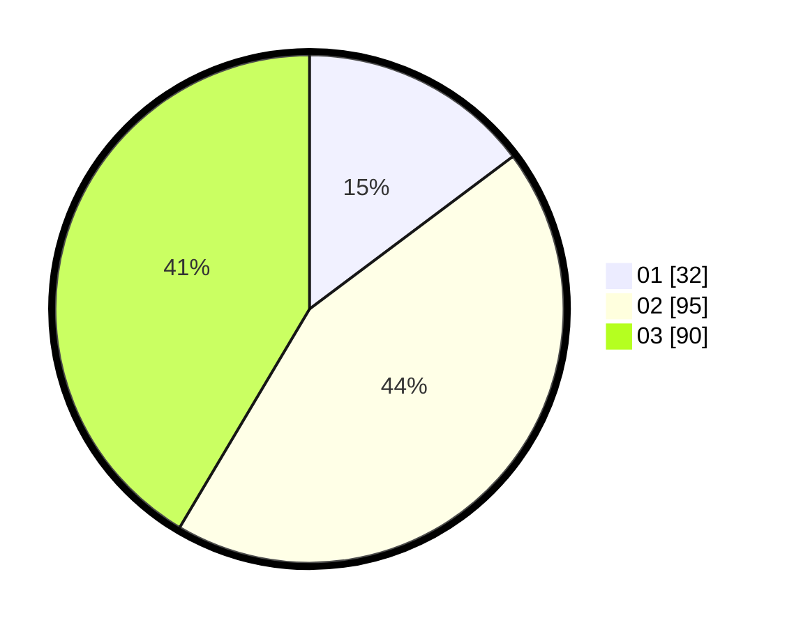

# Hasil

Hasil perolehan suara paslon dapat dilihat pada file paslon-01.txt, paslon-02.txt, dan paslon-03.txt.

Jika tidak ada, artinya data tersebut belum ada pada SIREKAP.

## Perolehan Suara

 * Paslon 01: **32**.
 * Paslon 02: **95**.
 * Paslon 03: **90**.

## Foto C Plano

https://sirekap-obj-formc.kpu.go.id/bb1e/pemilu/ppwp/31/73/02/10/06/3173021006029-20240214-155555--17e9ba34-9b1c-406b-9ea3-32f5b5a71471.jpg

https://sirekap-obj-formc.kpu.go.id/bb1e/pemilu/ppwp/31/73/02/10/06/3173021006029-20240214-185356--41ebdef8-4a38-435d-b169-e4212a376301.jpg

https://sirekap-obj-formc.kpu.go.id/bb1e/pemilu/ppwp/31/73/02/10/06/3173021006029-20240214-185558--63bdab9d-ba3e-479d-9388-1be86543a4c9.jpg

## DATA PEMILIH TETAP

Jumlah pemilih dalam DPT: **290**.
 * L: **121**.
 * P: **169**.

## DATA PENGGUNA HAK PILIH

Jumlah pengguna hak pilih dalam DPT: **214**.
 * L: **92**.
 * P: **122**.

Jumlah pengguna hak pilih dalam DPTb: **1**.
 * L: **1**.
 * P: **0**.

Jumlah pengguna hak pilih dalam DPK: **4**.
 * L: **2**.
 * P: **2**.

Jumlah pengguna hak pilih: **219**.
 * L: **95**.
 * P: **124**.

## JUMLAH SUARA SAH DAN TIDAK SAH

JUMLAH SELURUH SUARA SAH: **217**.

JUMLAH SUARA TIDAK SAH: **2**.

JUMLAH SELURUH SUARA SAH DAN SUARA TIDAK SAH: **219**.
