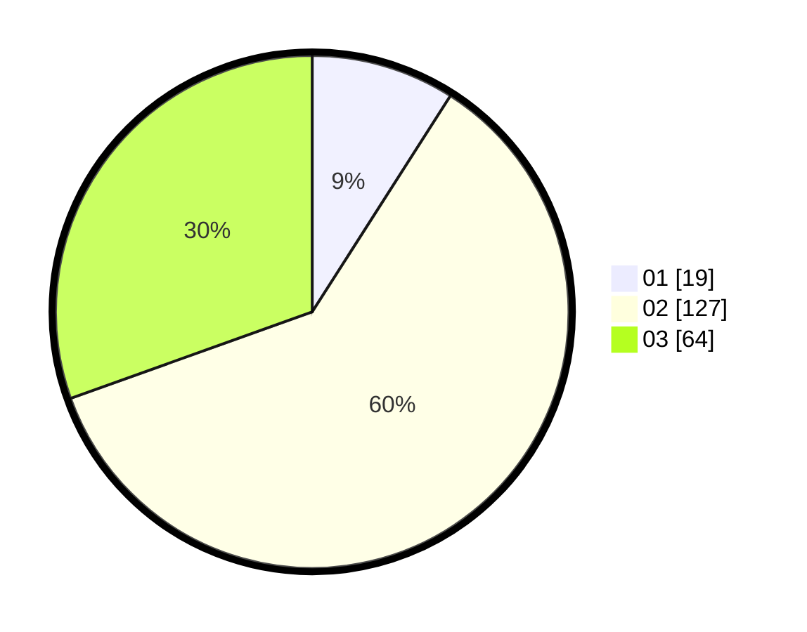

# Hasil

Hasil perolehan suara paslon dapat dilihat pada file paslon-01.txt, paslon-02.txt, dan paslon-03.txt.

Jika tidak ada, artinya data tersebut belum ada pada SIREKAP.

## Perolehan Suara

 * Paslon 01: **19**.
 * Paslon 02: **127**.
 * Paslon 03: **64**.

## Foto C Plano

https://sirekap-obj-formc.kpu.go.id/6045/pemilu/ppwp/31/73/02/10/06/3173021006033-20240214-191419--084d712b-3910-4c69-bbb8-7a8fe936c047.jpg

https://sirekap-obj-formc.kpu.go.id/6045/pemilu/ppwp/31/73/02/10/06/3173021006033-20240214-192341--f17f0c84-50a0-43a8-8c8b-928136216841.jpg

https://sirekap-obj-formc.kpu.go.id/6045/pemilu/ppwp/31/73/02/10/06/3173021006033-20240214-191423--366854ed-250a-4e34-8b22-f973aca0a88b.jpg

## DATA PEMILIH TETAP

Jumlah pemilih dalam DPT: **286**.
 * L: **140**.
 * P: **146**.

## DATA PENGGUNA HAK PILIH

Jumlah pengguna hak pilih dalam DPT: **209**.
 * L: **103**.
 * P: **106**.

Jumlah pengguna hak pilih dalam DPTb: **2**.
 * L: **1**.
 * P: **1**.

Jumlah pengguna hak pilih dalam DPK: **0**.
 * L: **0**.
 * P: **0**.

Jumlah pengguna hak pilih: **211**.
 * L: **104**.
 * P: **107**.

## JUMLAH SUARA SAH DAN TIDAK SAH

JUMLAH SELURUH SUARA SAH: **210**.

JUMLAH SUARA TIDAK SAH: **1**.

JUMLAH SELURUH SUARA SAH DAN SUARA TIDAK SAH: **211**.
