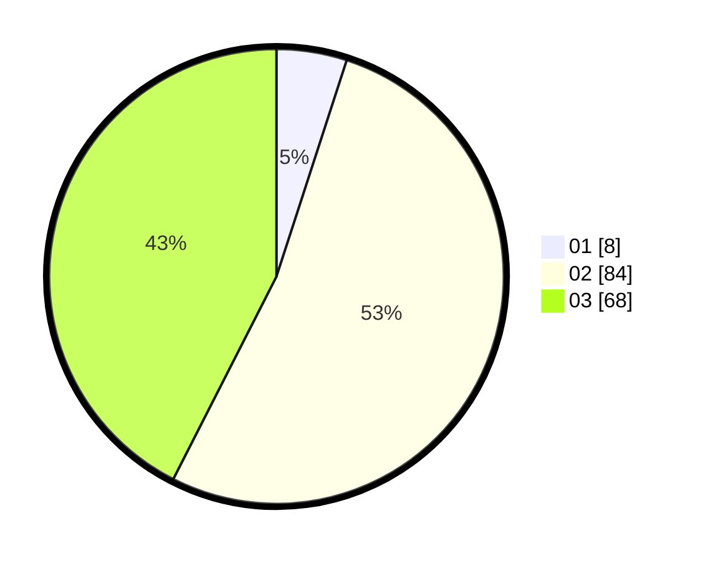

# Hasil

Hasil perolehan suara paslon dapat dilihat pada file paslon-01.txt, paslon-02.txt, dan paslon-03.txt.

Jika tidak ada, artinya data tersebut belum ada pada SIREKAP.

## Perolehan Suara

 * Paslon 01: **8**.
 * Paslon 02: **84**.
 * Paslon 03: **68**.

## Foto C Plano

https://sirekap-obj-formc.kpu.go.id/cee1/pemilu/ppwp/31/73/02/10/06/3173021006034-20240215-182533--a71e5008-5b70-435c-a030-336214a5d51c.jpg

https://sirekap-obj-formc.kpu.go.id/cee1/pemilu/ppwp/31/73/02/10/06/3173021006034-20240215-182601--c54dbd67-02ad-41c4-8e34-f512172432db.jpg

https://sirekap-obj-formc.kpu.go.id/cee1/pemilu/ppwp/31/73/02/10/06/3173021006034-20240215-182543--4347d4b6-d8fa-4b06-ba09-2e010f126225.jpg

## DATA PEMILIH TETAP

Jumlah pemilih dalam DPT: **239**.
 * L: **119**.
 * P: **120**.

## DATA PENGGUNA HAK PILIH

Jumlah pengguna hak pilih dalam DPT: **161**.
 * L: **78**.
 * P: **83**.

Jumlah pengguna hak pilih dalam DPTb: **1**.
 * L: **1**.
 * P: **0**.

Jumlah pengguna hak pilih dalam DPK: **1**.
 * L: **0**.
 * P: **1**.

Jumlah pengguna hak pilih: **163**.
 * L: **79**.
 * P: **84**.

## JUMLAH SUARA SAH DAN TIDAK SAH

JUMLAH SELURUH SUARA SAH: **160**.

JUMLAH SUARA TIDAK SAH: **3**.

JUMLAH SELURUH SUARA SAH DAN SUARA TIDAK SAH: **163**.
