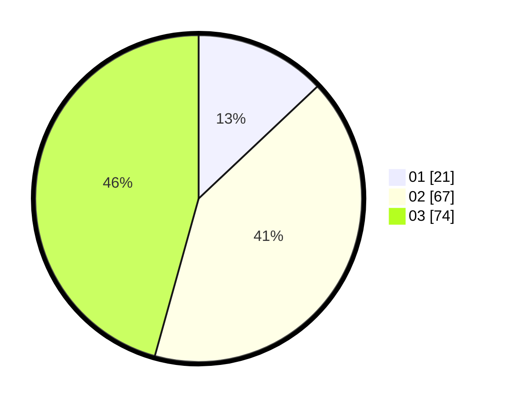

# Hasil

Hasil perolehan suara paslon dapat dilihat pada file paslon-01.txt, paslon-02.txt, dan paslon-03.txt.

Jika tidak ada, artinya data tersebut belum ada pada SIREKAP.

## Perolehan Suara

 * Paslon 01: **21**.
 * Paslon 02: **67**.
 * Paslon 03: **74**.

## Foto C Plano

https://sirekap-obj-formc.kpu.go.id/e8e2/pemilu/ppwp/31/73/02/10/06/3173021006040-20240214-204615--10c5bdeb-9df6-41b2-b807-6e197f449889.jpg

https://sirekap-obj-formc.kpu.go.id/e8e2/pemilu/ppwp/31/73/02/10/06/3173021006040-20240214-205012--bde3c55f-e15f-42ec-a40b-23745c21e098.jpg

https://sirekap-obj-formc.kpu.go.id/e8e2/pemilu/ppwp/31/73/02/10/06/3173021006040-20240214-205203--71a60a47-41fd-4e8a-9adc-75d27f033e24.jpg
