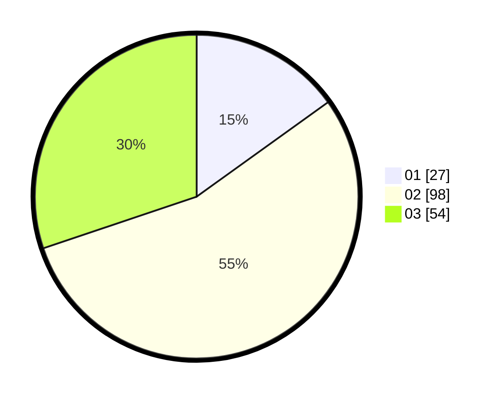

# Hasil

Hasil perolehan suara paslon dapat dilihat pada file paslon-01.txt, paslon-02.txt, dan paslon-03.txt.

Jika tidak ada, artinya data tersebut belum ada pada SIREKAP.

## Perolehan Suara

 * Paslon 01: **27**.
 * Paslon 02: **98**.
 * Paslon 03: **54**.

## Foto C Plano

https://sirekap-obj-formc.kpu.go.id/eb7c/pemilu/ppwp/31/73/02/10/06/3173021006041-20240215-022216--5c60d634-6853-4927-ae16-da14a3d4da9f.jpg

https://sirekap-obj-formc.kpu.go.id/eb7c/pemilu/ppwp/31/73/02/10/06/3173021006041-20240215-022305--c691ff39-d3f7-4741-94f3-db5d6fb60caa.jpg

https://sirekap-obj-formc.kpu.go.id/eb7c/pemilu/ppwp/31/73/02/10/06/3173021006041-20240215-022403--77970b8d-b35e-483b-9efa-76291058734f.jpg
