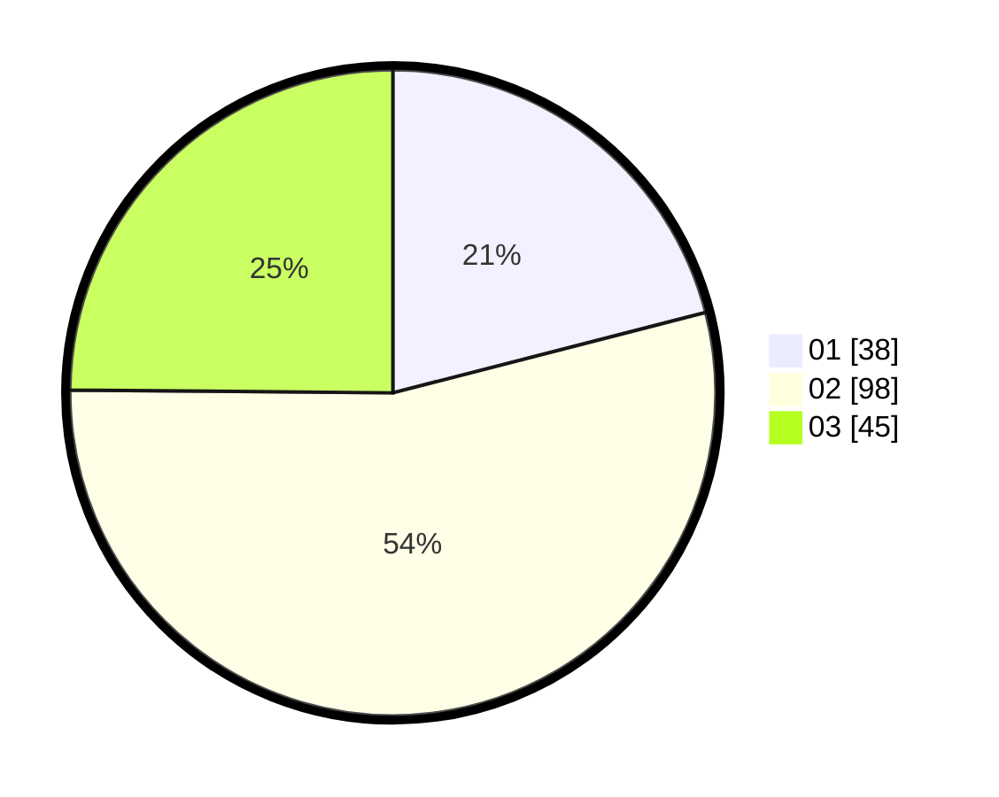

# Hasil

Hasil perolehan suara paslon dapat dilihat pada file paslon-01.txt, paslon-02.txt, dan paslon-03.txt.

Jika tidak ada, artinya data tersebut belum ada pada SIREKAP.

## Perolehan Suara

 * Paslon 01: **38**.
 * Paslon 02: **98**.
 * Paslon 03: **45**.

## Foto C Plano

https://sirekap-obj-formc.kpu.go.id/0703/pemilu/ppwp/31/73/02/10/06/3173021006046-20240214-155751--7b5c7396-b1e7-4263-a3b2-fdfca4252bfa.jpg

https://sirekap-obj-formc.kpu.go.id/0703/pemilu/ppwp/31/73/02/10/06/3173021006046-20240214-184324--fef65434-36e0-4fea-912f-792779f7e8b6.jpg

https://sirekap-obj-formc.kpu.go.id/0703/pemilu/ppwp/31/73/02/10/06/3173021006046-20240214-185153--63873dab-7e2a-47ad-ba51-bd03655b563d.jpg

## DATA PEMILIH TETAP

Jumlah pemilih dalam DPT: **250**.
 * L: **118**.
 * P: **132**.

## DATA PENGGUNA HAK PILIH

Jumlah pengguna hak pilih dalam DPT: **183**.
 * L: **86**.
 * P: **97**.

Jumlah pengguna hak pilih dalam DPTb: **0**.
 * L: **0**.
 * P: **0**.

Jumlah pengguna hak pilih dalam DPK: **1**.
 * L: **1**.
 * P: **0**.

Jumlah pengguna hak pilih: **184**.
 * L: **87**.
 * P: **97**.

## JUMLAH SUARA SAH DAN TIDAK SAH

JUMLAH SELURUH SUARA SAH: **181**.

JUMLAH SUARA TIDAK SAH: **2**.

JUMLAH SELURUH SUARA SAH DAN SUARA TIDAK SAH: **183**.
