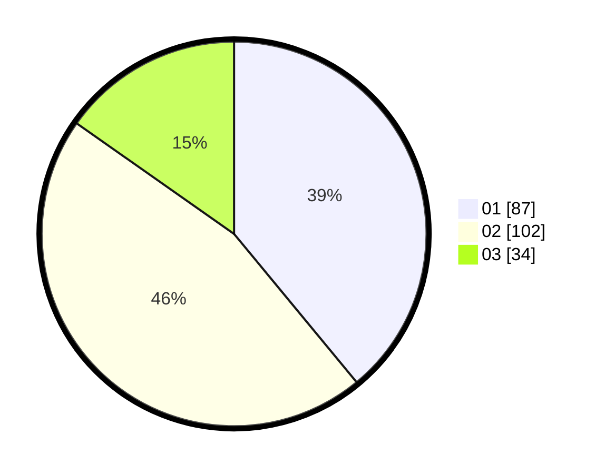

# Hasil

Hasil perolehan suara paslon dapat dilihat pada file paslon-01.txt, paslon-02.txt, dan paslon-03.txt.

Jika tidak ada, artinya data tersebut belum ada pada SIREKAP.

## Perolehan Suara

 * Paslon 01: **87**.
 * Paslon 02: **102**.
 * Paslon 03: **34**.

## Foto C Plano

https://sirekap-obj-formc.kpu.go.id/c9e2/pemilu/ppwp/31/73/02/10/06/3173021006052-20240214-193640--3adebf25-0343-4f88-9318-eb7648234d2c.jpg

https://sirekap-obj-formc.kpu.go.id/c9e2/pemilu/ppwp/31/73/02/10/06/3173021006052-20240214-193703--0bdd82c8-7794-4ce1-803f-a62aaca300f8.jpg

https://sirekap-obj-formc.kpu.go.id/c9e2/pemilu/ppwp/31/73/02/10/06/3173021006052-20240214-193718--199c32cb-b37a-427f-a174-6373cf5886e2.jpg
