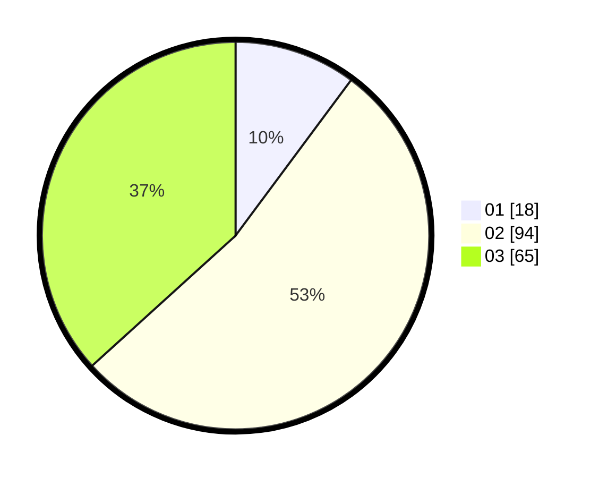

# Hasil

Hasil perolehan suara paslon dapat dilihat pada file paslon-01.txt, paslon-02.txt, dan paslon-03.txt.

Jika tidak ada, artinya data tersebut belum ada pada SIREKAP.

## Perolehan Suara

 * Paslon 01: **18**.
 * Paslon 02: **94**.
 * Paslon 03: **65**.

## Foto C Plano

https://sirekap-obj-formc.kpu.go.id/3621/pemilu/ppwp/31/73/02/10/06/3173021006063-20240215-000053--a4d72320-b368-468a-b21e-02dd753a7c25.jpg

https://sirekap-obj-formc.kpu.go.id/3621/pemilu/ppwp/31/73/02/10/06/3173021006063-20240215-001057--aef9fc9f-5851-4b19-af74-129cec16daf2.jpg

https://sirekap-obj-formc.kpu.go.id/3621/pemilu/ppwp/31/73/02/10/06/3173021006063-20240215-000249--38d781c8-9c37-4c82-97e8-9bff67682186.jpg
