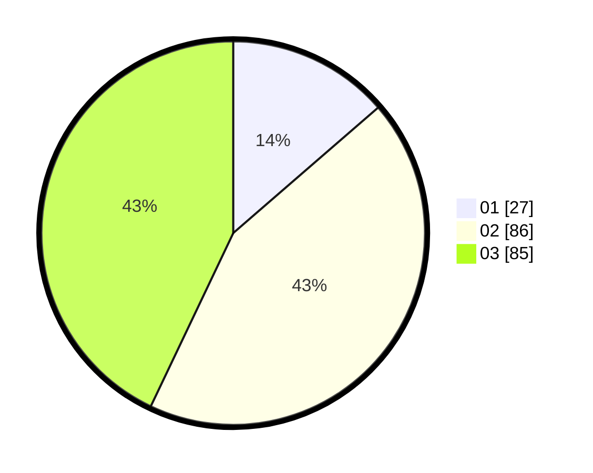

# Hasil

Hasil perolehan suara paslon dapat dilihat pada file paslon-01.txt, paslon-02.txt, dan paslon-03.txt.

Jika tidak ada, artinya data tersebut belum ada pada SIREKAP.

## Perolehan Suara

 * Paslon 01: **27**.
 * Paslon 02: **86**.
 * Paslon 03: **85**.

## Foto C Plano

https://sirekap-obj-formc.kpu.go.id/fcf4/pemilu/ppwp/31/73/02/10/06/3173021006072-20240214-190035--e1052e9b-efd5-453a-9513-c3742555fa4e.jpg

https://sirekap-obj-formc.kpu.go.id/fcf4/pemilu/ppwp/31/73/02/10/06/3173021006072-20240214-190047--e71d9366-279a-4f71-a42d-c1532b902361.jpg

https://sirekap-obj-formc.kpu.go.id/fcf4/pemilu/ppwp/31/73/02/10/06/3173021006072-20240214-190053--1ec53ad1-8e4c-4fd3-bfdf-6cf3e7019a5e.jpg

## DATA PEMILIH TETAP

Jumlah pemilih dalam DPT: **260**.
 * L: **120**.
 * P: **140**.

## DATA PENGGUNA HAK PILIH

Jumlah pengguna hak pilih dalam DPT: **205**.
 * L: **101**.
 * P: **104**.

Jumlah pengguna hak pilih dalam DPTb: **0**.
 * L: **0**.
 * P: **0**.

Jumlah pengguna hak pilih dalam DPK: **3**.
 * L: **2**.
 * P: **1**.

Jumlah pengguna hak pilih: **208**.
 * L: **103**.
 * P: **105**.

## JUMLAH SUARA SAH DAN TIDAK SAH

JUMLAH SELURUH SUARA SAH: **194**.

JUMLAH SUARA TIDAK SAH: **10**.

JUMLAH SELURUH SUARA SAH DAN SUARA TIDAK SAH: **208**.
