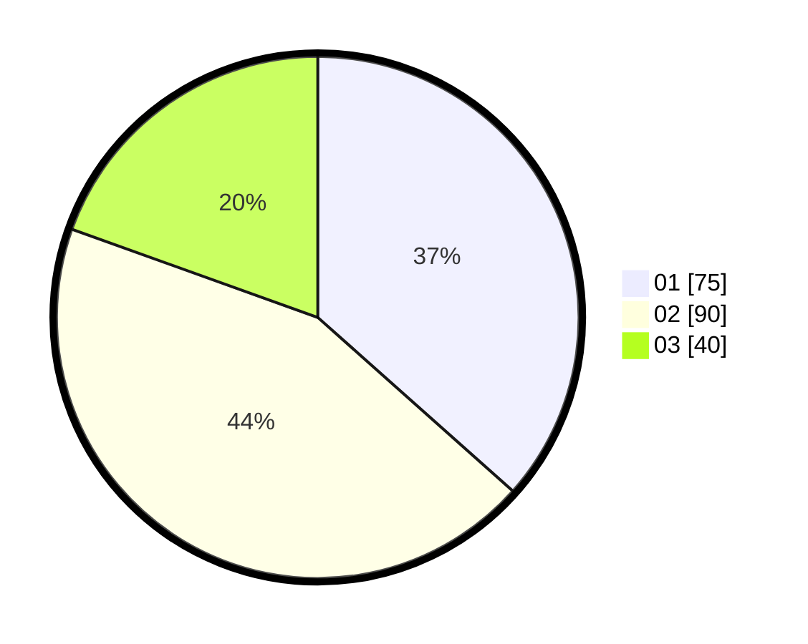

# Hasil

Hasil perolehan suara paslon dapat dilihat pada file paslon-01.txt, paslon-02.txt, dan paslon-03.txt.

Jika tidak ada, artinya data tersebut belum ada pada SIREKAP.

## Perolehan Suara

 * Paslon 01: **75**.
 * Paslon 02: **90**.
 * Paslon 03: **40**.

## Foto C Plano

https://sirekap-obj-formc.kpu.go.id/8296/pemilu/ppwp/31/73/02/10/06/3173021006077-20240214-214400--35375382-1971-4c4c-98d0-3ea764391722.jpg

https://sirekap-obj-formc.kpu.go.id/8296/pemilu/ppwp/31/73/02/10/06/3173021006077-20240214-214504--49c4c0a6-e0bc-49f3-bbc3-9d16671bf848.jpg

https://sirekap-obj-formc.kpu.go.id/8296/pemilu/ppwp/31/73/02/10/06/3173021006077-20240214-214600--585bf6da-c9ce-4a4d-98b4-42c676cffae6.jpg

## DATA PEMILIH TETAP

Jumlah pemilih dalam DPT: **283**.
 * L: **138**.
 * P: **145**.

## DATA PENGGUNA HAK PILIH

Jumlah pengguna hak pilih dalam DPT: **209**.
 * L: **98**.
 * P: **111**.

Jumlah pengguna hak pilih dalam DPTb: **1**.
 * L: **0**.
 * P: **1**.

Jumlah pengguna hak pilih dalam DPK: **0**.
 * L: **0**.
 * P: **0**.

Jumlah pengguna hak pilih: **210**.
 * L: **98**.
 * P: **112**.

## JUMLAH SUARA SAH DAN TIDAK SAH

JUMLAH SELURUH SUARA SAH: **205**.

JUMLAH SUARA TIDAK SAH: **5**.

JUMLAH SELURUH SUARA SAH DAN SUARA TIDAK SAH: **210**.
