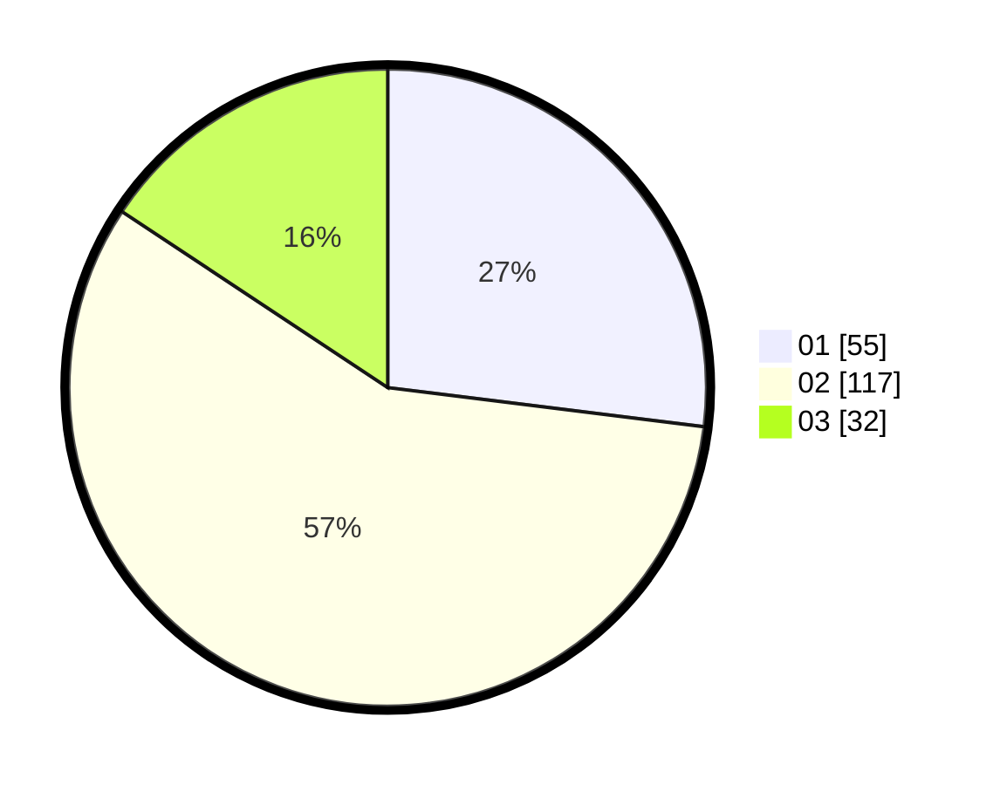

# Hasil

Hasil perolehan suara paslon dapat dilihat pada file paslon-01.txt, paslon-02.txt, dan paslon-03.txt.

Jika tidak ada, artinya data tersebut belum ada pada SIREKAP.

## Perolehan Suara

 * Paslon 01: **55**.
 * Paslon 02: **117**.
 * Paslon 03: **32**.

## Foto C Plano

https://sirekap-obj-formc.kpu.go.id/1bd6/pemilu/ppwp/31/73/02/10/06/3173021006082-20240214-194844--e0618cc7-314c-47d6-83cf-5a9926496a65.jpg

https://sirekap-obj-formc.kpu.go.id/1bd6/pemilu/ppwp/31/73/02/10/06/3173021006082-20240214-193902--7645790b-3ccc-4a11-975c-fbe25613924f.jpg

https://sirekap-obj-formc.kpu.go.id/1bd6/pemilu/ppwp/31/73/02/10/06/3173021006082-20240214-200951--6311831d-3e81-4c7d-bc9e-1cfe4a8f2597.jpg

## DATA PEMILIH TETAP

Jumlah pemilih dalam DPT: **286**.
 * L: **160**.
 * P: **126**.

## DATA PENGGUNA HAK PILIH

Jumlah pengguna hak pilih dalam DPT: **203**.
 * L: **113**.
 * P: **90**.

Jumlah pengguna hak pilih dalam DPTb: **0**.
 * L: **0**.
 * P: **0**.

Jumlah pengguna hak pilih dalam DPK: **3**.
 * L: **1**.
 * P: **2**.

Jumlah pengguna hak pilih: **206**.
 * L: **114**.
 * P: **92**.

## JUMLAH SUARA SAH DAN TIDAK SAH

JUMLAH SELURUH SUARA SAH: **204**.

JUMLAH SUARA TIDAK SAH: **2**.

JUMLAH SELURUH SUARA SAH DAN SUARA TIDAK SAH: **206**.
