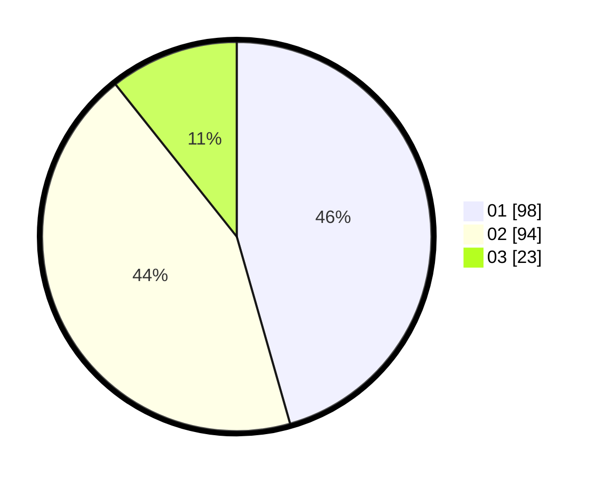

# Hasil

Hasil perolehan suara paslon dapat dilihat pada file paslon-01.txt, paslon-02.txt, dan paslon-03.txt.

Jika tidak ada, artinya data tersebut belum ada pada SIREKAP.

## Perolehan Suara

 * Paslon 01: **98**.
 * Paslon 02: **94**.
 * Paslon 03: **23**.

## Foto C Plano

https://sirekap-obj-formc.kpu.go.id/3561/pemilu/ppwp/31/73/02/10/06/3173021006084-20240215-200339--dc669b4a-76ca-4cd8-9ff2-03762dff6f3d.jpg

https://sirekap-obj-formc.kpu.go.id/3561/pemilu/ppwp/31/73/02/10/06/3173021006084-20240215-195956--54136567-5393-40de-8f5d-d93360a6f748.jpg

https://sirekap-obj-formc.kpu.go.id/3561/pemilu/ppwp/31/73/02/10/06/3173021006084-20240215-200057--51a01612-8cd8-4fdb-9919-adff70dd3bd0.jpg
