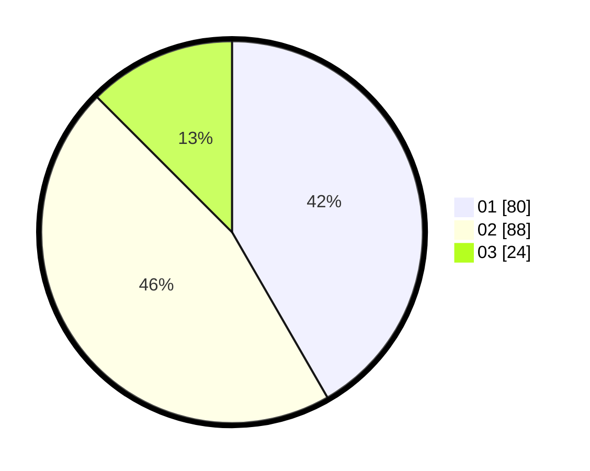

# Hasil

Hasil perolehan suara paslon dapat dilihat pada file paslon-01.txt, paslon-02.txt, dan paslon-03.txt.

Jika tidak ada, artinya data tersebut belum ada pada SIREKAP.

## Perolehan Suara

 * Paslon 01: **80**.
 * Paslon 02: **88**.
 * Paslon 03: **24**.

## Foto C Plano

https://sirekap-obj-formc.kpu.go.id/64d3/pemilu/ppwp/31/73/02/10/06/3173021006085-20240214-214433--9317d073-a506-423c-85f3-3a526d1fccac.jpg

https://sirekap-obj-formc.kpu.go.id/64d3/pemilu/ppwp/31/73/02/10/06/3173021006085-20240214-213844--467dd900-a920-4a4d-b860-6eb4e9a2387e.jpg

https://sirekap-obj-formc.kpu.go.id/64d3/pemilu/ppwp/31/73/02/10/06/3173021006085-20240214-214540--d1a81a15-4560-4ba1-bc71-aabc0dde93be.jpg
