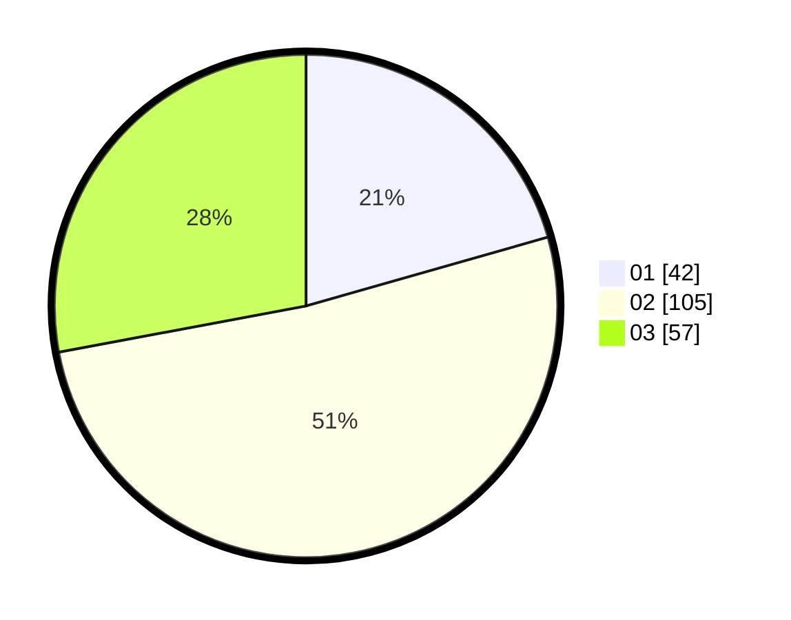

# Hasil

Hasil perolehan suara paslon dapat dilihat pada file paslon-01.txt, paslon-02.txt, dan paslon-03.txt.

Jika tidak ada, artinya data tersebut belum ada pada SIREKAP.

## Perolehan Suara

 * Paslon 01: **42**.
 * Paslon 02: **105**.
 * Paslon 03: **57**.

## Foto C Plano

https://sirekap-obj-formc.kpu.go.id/aced/pemilu/ppwp/31/73/02/10/06/3173021006094-20240216-094133--d1e5d506-b314-4c2f-bb61-58bed4cb10c0.jpg

https://sirekap-obj-formc.kpu.go.id/aced/pemilu/ppwp/31/73/02/10/06/3173021006094-20240216-094408--ed921442-040a-4561-9bfe-969afc4a2a30.jpg

https://sirekap-obj-formc.kpu.go.id/aced/pemilu/ppwp/31/73/02/10/06/3173021006094-20240216-094532--5cf8e6d9-bae4-4ce0-948c-3d11f3ee0370.jpg

## DATA PEMILIH TETAP

Jumlah pemilih dalam DPT: **267**.
 * L: **119**.
 * P: **148**.

## DATA PENGGUNA HAK PILIH

Jumlah pengguna hak pilih dalam DPT: **204**.
 * L: **87**.
 * P: **117**.

Jumlah pengguna hak pilih dalam DPTb: **0**.
 * L: **0**.
 * P: **0**.

Jumlah pengguna hak pilih dalam DPK: **0**.
 * L: **0**.
 * P: **0**.

Jumlah pengguna hak pilih: **204**.
 * L: **87**.
 * P: **117**.

## JUMLAH SUARA SAH DAN TIDAK SAH

JUMLAH SELURUH SUARA SAH: **199**.

JUMLAH SUARA TIDAK SAH: **5**.

JUMLAH SELURUH SUARA SAH DAN SUARA TIDAK SAH: **204**.
