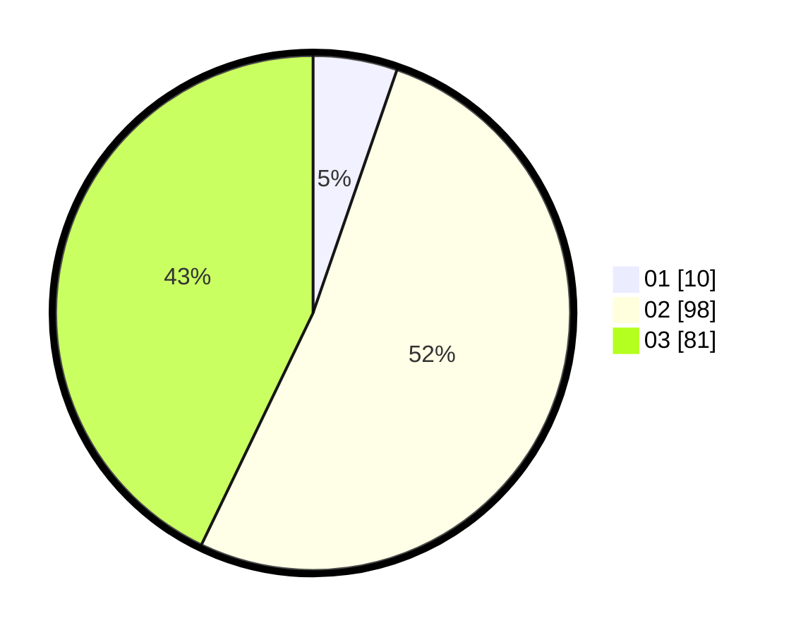

# Hasil

Hasil perolehan suara paslon dapat dilihat pada file paslon-01.txt, paslon-02.txt, dan paslon-03.txt.

Jika tidak ada, artinya data tersebut belum ada pada SIREKAP.

## Perolehan Suara

 * Paslon 01: **10**.
 * Paslon 02: **98**.
 * Paslon 03: **81**.

## Foto C Plano

https://sirekap-obj-formc.kpu.go.id/493c/pemilu/ppwp/31/73/02/10/06/3173021006095-20240214-160145--41bd119c-f8bf-478d-839d-bbae9e4554c0.jpg

https://sirekap-obj-formc.kpu.go.id/493c/pemilu/ppwp/31/73/02/10/06/3173021006095-20240214-190051--324775eb-b700-4c58-9cd4-04fb6613d306.jpg

https://sirekap-obj-formc.kpu.go.id/493c/pemilu/ppwp/31/73/02/10/06/3173021006095-20240214-190110--c1b03fcb-c34a-4ee9-92e6-a004615f699e.jpg

## DATA PEMILIH TETAP

Jumlah pemilih dalam DPT: **265**.
 * L: **132**.
 * P: **133**.

## DATA PENGGUNA HAK PILIH

Jumlah pengguna hak pilih dalam DPT: **184**.
 * L: **91**.
 * P: **93**.

Jumlah pengguna hak pilih dalam DPTb: **0**.
 * L: **0**.
 * P: **0**.

Jumlah pengguna hak pilih dalam DPK: **7**.
 * L: **2**.
 * P: **5**.

Jumlah pengguna hak pilih: **191**.
 * L: **93**.
 * P: **98**.

## JUMLAH SUARA SAH DAN TIDAK SAH

JUMLAH SELURUH SUARA SAH: **189**.

JUMLAH SUARA TIDAK SAH: **2**.

JUMLAH SELURUH SUARA SAH DAN SUARA TIDAK SAH: **191**.
