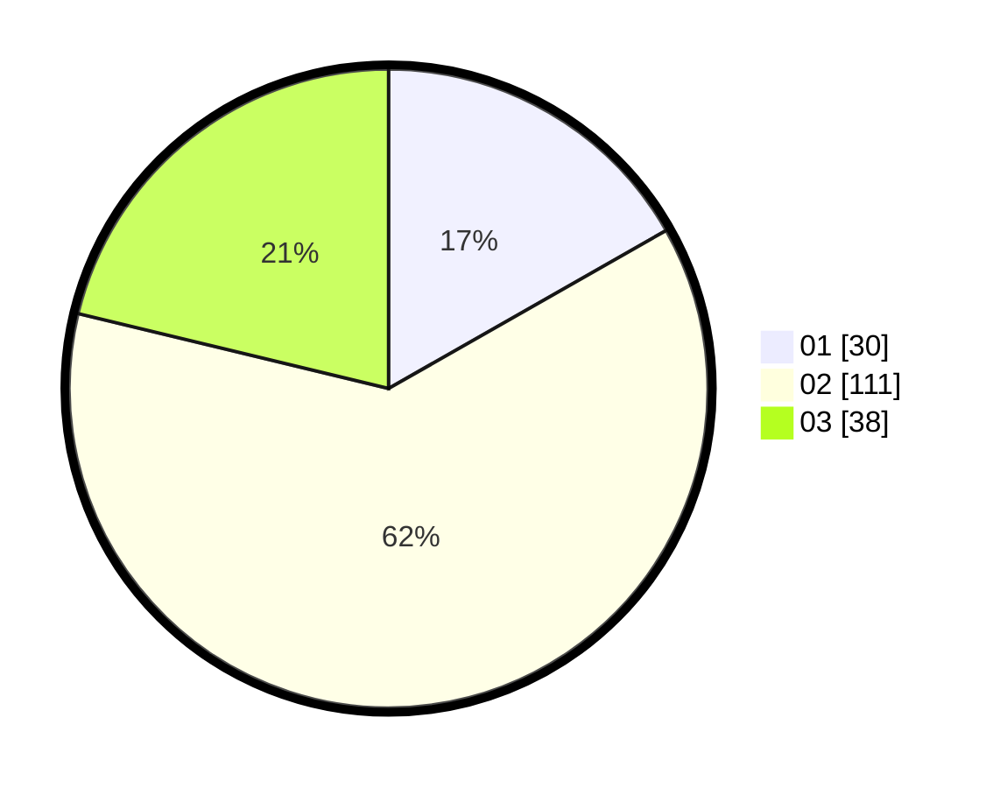

# Hasil

Hasil perolehan suara paslon dapat dilihat pada file paslon-01.txt, paslon-02.txt, dan paslon-03.txt.

Jika tidak ada, artinya data tersebut belum ada pada SIREKAP.

## Perolehan Suara

 * Paslon 01: **30**.
 * Paslon 02: **111**.
 * Paslon 03: **38**.

## Foto C Plano

https://sirekap-obj-formc.kpu.go.id/d7c2/pemilu/ppwp/31/73/02/10/06/3173021006096-20240214-141215--2661cebd-c7a4-41df-bed7-daf17cfed35e.jpg

https://sirekap-obj-formc.kpu.go.id/d7c2/pemilu/ppwp/31/73/02/10/06/3173021006096-20240214-160118--bd4f36bf-6ed6-4100-903a-66466bd672f0.jpg

https://sirekap-obj-formc.kpu.go.id/d7c2/pemilu/ppwp/31/73/02/10/06/3173021006096-20240214-160128--66aac8f0-3845-4397-86ab-423feac79c3e.jpg

## DATA PEMILIH TETAP

Jumlah pemilih dalam DPT: **269**.
 * L: **144**.
 * P: **125**.

## DATA PENGGUNA HAK PILIH

Jumlah pengguna hak pilih dalam DPT: **140**.
 * L: **47**.
 * P: **47**.

Jumlah pengguna hak pilih dalam DPTb: **0**.
 * L: **0**.
 * P: **0**.

Jumlah pengguna hak pilih dalam DPK: **0**.
 * L: **0**.
 * P: **0**.

Jumlah pengguna hak pilih: **184**.
 * L: **47**.
 * P: **47**.

## JUMLAH SUARA SAH DAN TIDAK SAH

JUMLAH SELURUH SUARA SAH: **179**.

JUMLAH SUARA TIDAK SAH: **1**.

JUMLAH SELURUH SUARA SAH DAN SUARA TIDAK SAH: **140**.
