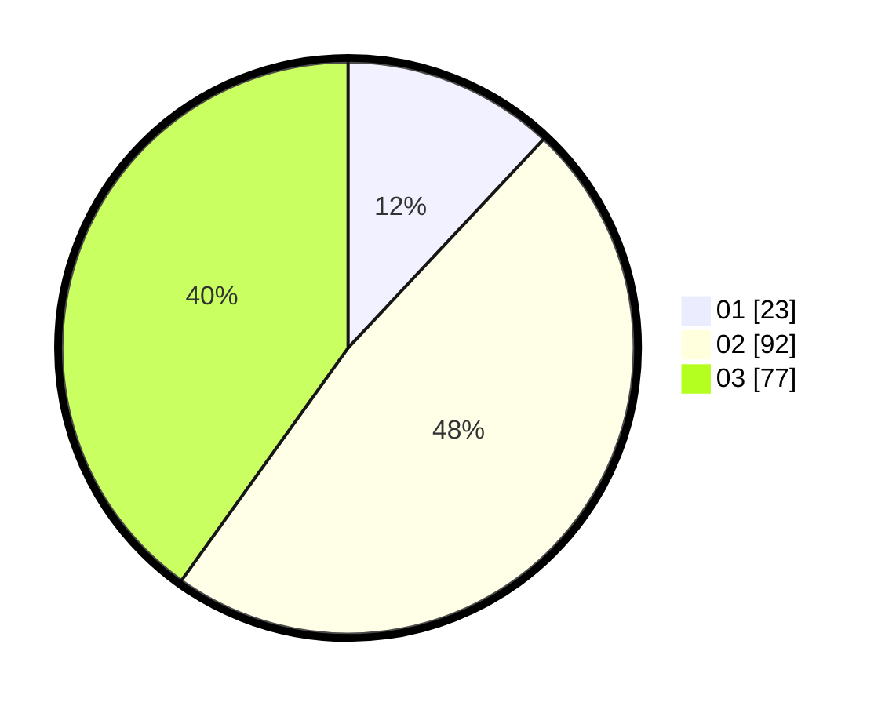

# Hasil

Hasil perolehan suara paslon dapat dilihat pada file paslon-01.txt, paslon-02.txt, dan paslon-03.txt.

Jika tidak ada, artinya data tersebut belum ada pada SIREKAP.

## Perolehan Suara

 * Paslon 01: **23**.
 * Paslon 02: **92**.
 * Paslon 03: **77**.

## Foto C Plano

https://sirekap-obj-formc.kpu.go.id/0d79/pemilu/ppwp/31/73/02/10/06/3173021006105-20240215-011615--616922d6-2dae-4a60-a4d0-da9bf48d81df.jpg

https://sirekap-obj-formc.kpu.go.id/0d79/pemilu/ppwp/31/73/02/10/06/3173021006105-20240215-011636--faaac7cd-e6ec-4633-92c2-7cd7305652b3.jpg

https://sirekap-obj-formc.kpu.go.id/0d79/pemilu/ppwp/31/73/02/10/06/3173021006105-20240215-011625--9f9f6e1a-08e3-4ae5-80c2-165cb0a2c096.jpg

## DATA PEMILIH TETAP

Jumlah pemilih dalam DPT: **266**.
 * L: **132**.
 * P: **134**.

## DATA PENGGUNA HAK PILIH

Jumlah pengguna hak pilih dalam DPT: **195**.
 * L: **95**.
 * P: **100**.

Jumlah pengguna hak pilih dalam DPTb: **0**.
 * L: **0**.
 * P: **0**.

Jumlah pengguna hak pilih dalam DPK: **0**.
 * L: **0**.
 * P: **0**.

Jumlah pengguna hak pilih: **195**.
 * L: **95**.
 * P: **100**.

## JUMLAH SUARA SAH DAN TIDAK SAH

JUMLAH SELURUH SUARA SAH: **192**.

JUMLAH SUARA TIDAK SAH: **3**.

JUMLAH SELURUH SUARA SAH DAN SUARA TIDAK SAH: **195**.
