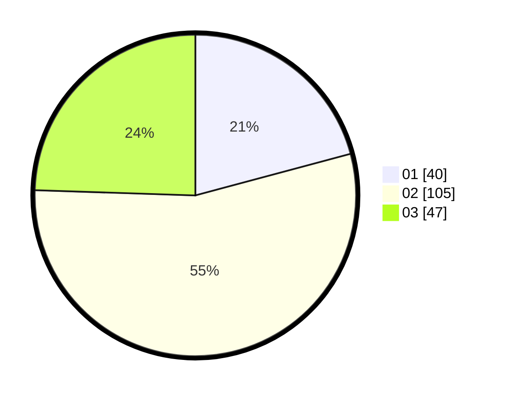

# Hasil

Hasil perolehan suara paslon dapat dilihat pada file paslon-01.txt, paslon-02.txt, dan paslon-03.txt.

Jika tidak ada, artinya data tersebut belum ada pada SIREKAP.

## Perolehan Suara

 * Paslon 01: **40**.
 * Paslon 02: **105**.
 * Paslon 03: **47**.

## Foto C Plano

https://sirekap-obj-formc.kpu.go.id/5543/pemilu/ppwp/31/73/02/10/06/3173021006109-20240215-005833--0a1c8428-3b88-4dc6-8832-c52bb38912e5.jpg

https://sirekap-obj-formc.kpu.go.id/5543/pemilu/ppwp/31/73/02/10/06/3173021006109-20240215-005933--76a644d6-e51a-4f87-baef-c7736cd8831b.jpg

https://sirekap-obj-formc.kpu.go.id/5543/pemilu/ppwp/31/73/02/10/06/3173021006109-20240215-010029--8d0aa1bd-644c-4611-a3a5-bbc359afe338.jpg
