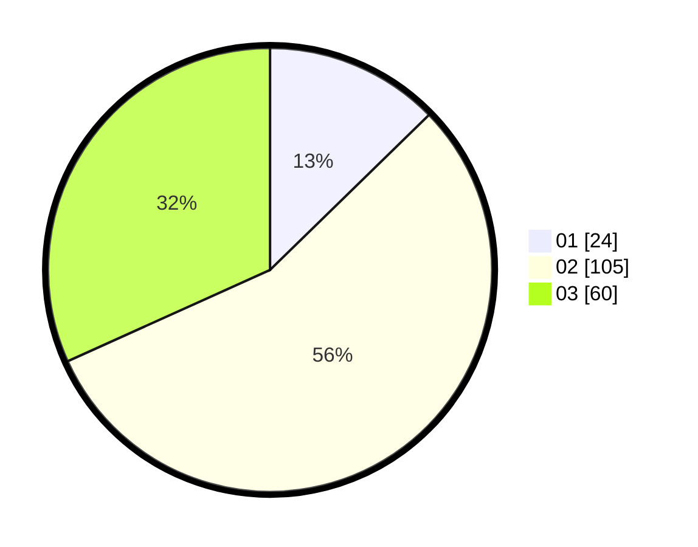

# Hasil

Hasil perolehan suara paslon dapat dilihat pada file paslon-01.txt, paslon-02.txt, dan paslon-03.txt.

Jika tidak ada, artinya data tersebut belum ada pada SIREKAP.

## Perolehan Suara

 * Paslon 01: **24**.
 * Paslon 02: **105**.
 * Paslon 03: **60**.

## Foto C Plano

https://sirekap-obj-formc.kpu.go.id/2275/pemilu/ppwp/31/73/02/10/06/3173021006112-20240214-155015--b9c40c1e-c440-4165-9a28-18360fe959a7.jpg

https://sirekap-obj-formc.kpu.go.id/2275/pemilu/ppwp/31/73/02/10/06/3173021006112-20240214-155213--6fb19a34-7b79-4e9c-b9d4-8f48bb0aef59.jpg

https://sirekap-obj-formc.kpu.go.id/2275/pemilu/ppwp/31/73/02/10/06/3173021006112-20240214-155303--035269d9-1787-4fed-a999-c2cbfadfcefd.jpg

## DATA PEMILIH TETAP

Jumlah pemilih dalam DPT: **274**.
 * L: **177**.
 * P: **127**.

## DATA PENGGUNA HAK PILIH

Jumlah pengguna hak pilih dalam DPT: **140**.
 * L: **100**.
 * P: **40**.

Jumlah pengguna hak pilih dalam DPTb: **2**.
 * L: **0**.
 * P: **2**.

Jumlah pengguna hak pilih dalam DPK: **0**.
 * L: **0**.
 * P: **0**.

Jumlah pengguna hak pilih: **192**.
 * L: **100**.
 * P: **42**.

## JUMLAH SUARA SAH DAN TIDAK SAH

JUMLAH SELURUH SUARA SAH: **189**.

JUMLAH SUARA TIDAK SAH: **3**.

JUMLAH SELURUH SUARA SAH DAN SUARA TIDAK SAH: **192**.
