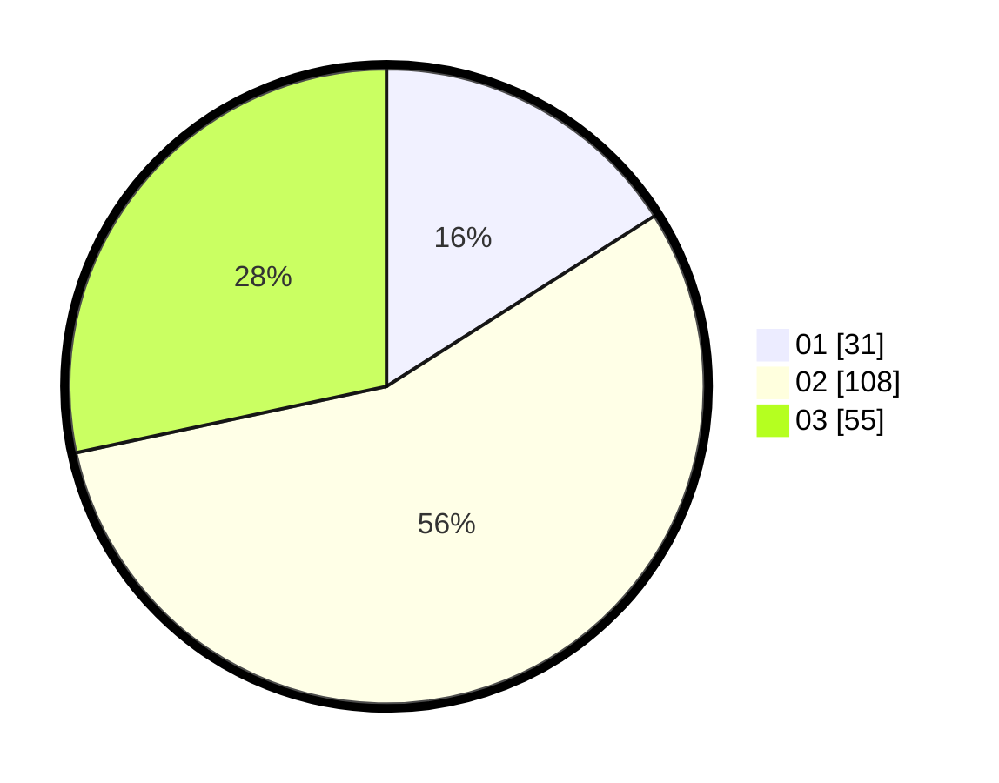

# Hasil

Hasil perolehan suara paslon dapat dilihat pada file paslon-01.txt, paslon-02.txt, dan paslon-03.txt.

Jika tidak ada, artinya data tersebut belum ada pada SIREKAP.

## Perolehan Suara

 * Paslon 01: **31**.
 * Paslon 02: **108**.
 * Paslon 03: **55**.

## Foto C Plano

https://sirekap-obj-formc.kpu.go.id/4605/pemilu/ppwp/31/73/02/10/06/3173021006114-20240214-185210--4d7336bc-c22d-4460-b8cc-ae37dbe5c717.jpg

https://sirekap-obj-formc.kpu.go.id/4605/pemilu/ppwp/31/73/02/10/06/3173021006114-20240214-200521--8ab524f1-01bc-4f1d-8b43-3515b21d3175.jpg

https://sirekap-obj-formc.kpu.go.id/4605/pemilu/ppwp/31/73/02/10/06/3173021006114-20240214-200621--84af5a98-9552-4932-a602-a87803a2155c.jpg

## DATA PEMILIH TETAP

Jumlah pemilih dalam DPT: **282**.
 * L: **141**.
 * P: **141**.

## DATA PENGGUNA HAK PILIH

Jumlah pengguna hak pilih dalam DPT: **197**.
 * L: **91**.
 * P: **106**.

Jumlah pengguna hak pilih dalam DPTb: **0**.
 * L: **0**.
 * P: **0**.

Jumlah pengguna hak pilih dalam DPK: **0**.
 * L: **0**.
 * P: **0**.

Jumlah pengguna hak pilih: **197**.
 * L: **91**.
 * P: **106**.

## JUMLAH SUARA SAH DAN TIDAK SAH

JUMLAH SELURUH SUARA SAH: **194**.

JUMLAH SUARA TIDAK SAH: **2**.

JUMLAH SELURUH SUARA SAH DAN SUARA TIDAK SAH: **197**.
