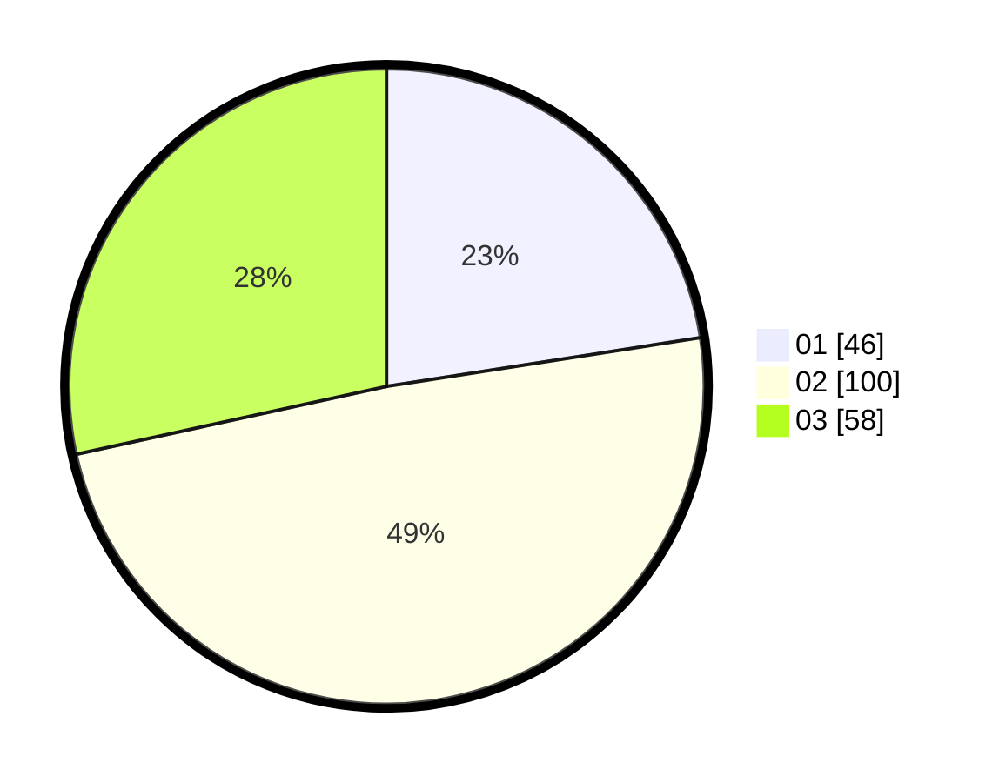

# Hasil

Hasil perolehan suara paslon dapat dilihat pada file paslon-01.txt, paslon-02.txt, dan paslon-03.txt.

Jika tidak ada, artinya data tersebut belum ada pada SIREKAP.

## Perolehan Suara

 * Paslon 01: **46**.
 * Paslon 02: **100**.
 * Paslon 03: **58**.

## Foto C Plano

https://sirekap-obj-formc.kpu.go.id/580f/pemilu/ppwp/31/73/02/10/06/3173021006115-20240214-185946--5818ad32-fbeb-4e70-847c-bd36162fcfa5.jpg

https://sirekap-obj-formc.kpu.go.id/580f/pemilu/ppwp/31/73/02/10/06/3173021006115-20240214-194224--c95d2856-1739-4621-b299-88824d7b7679.jpg

https://sirekap-obj-formc.kpu.go.id/580f/pemilu/ppwp/31/73/02/10/06/3173021006115-20240214-192245--28b901a0-b0dc-4268-ba6d-c88c254b09da.jpg

## DATA PEMILIH TETAP

Jumlah pemilih dalam DPT: **280**.
 * L: **134**.
 * P: **146**.

## DATA PENGGUNA HAK PILIH

Jumlah pengguna hak pilih dalam DPT: **204**.
 * L: **98**.
 * P: **106**.

Jumlah pengguna hak pilih dalam DPTb: **0**.
 * L: **0**.
 * P: **0**.

Jumlah pengguna hak pilih dalam DPK: **3**.
 * L: **1**.
 * P: **2**.

Jumlah pengguna hak pilih: **207**.
 * L: **99**.
 * P: **108**.

## JUMLAH SUARA SAH DAN TIDAK SAH

JUMLAH SELURUH SUARA SAH: **204**.

JUMLAH SUARA TIDAK SAH: **3**.

JUMLAH SELURUH SUARA SAH DAN SUARA TIDAK SAH: **207**.
