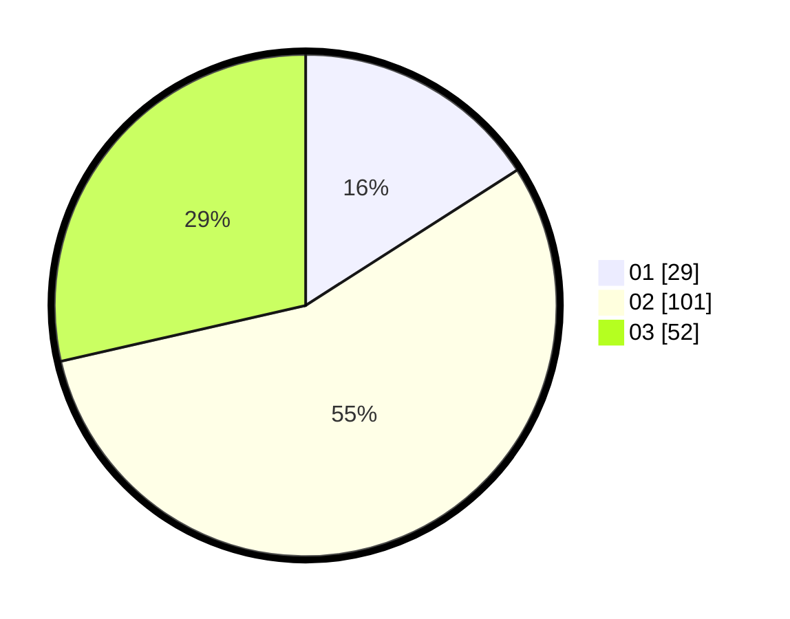

# Hasil

Hasil perolehan suara paslon dapat dilihat pada file paslon-01.txt, paslon-02.txt, dan paslon-03.txt.

Jika tidak ada, artinya data tersebut belum ada pada SIREKAP.

## Perolehan Suara

 * Paslon 01: **29**.
 * Paslon 02: **101**.
 * Paslon 03: **52**.

## Foto C Plano

https://sirekap-obj-formc.kpu.go.id/61df/pemilu/ppwp/31/73/02/10/06/3173021006117-20240214-194959--a5ae9894-5359-4f59-a173-7e328e0e6369.jpg

https://sirekap-obj-formc.kpu.go.id/61df/pemilu/ppwp/31/73/02/10/06/3173021006117-20240214-195035--f80602a3-5340-4676-a150-f55a2b853da5.jpg

https://sirekap-obj-formc.kpu.go.id/61df/pemilu/ppwp/31/73/02/10/06/3173021006117-20240214-195059--a648a640-4a81-4d70-82b6-013b08e167c6.jpg

## DATA PEMILIH TETAP

Jumlah pemilih dalam DPT: **268**.
 * L: **127**.
 * P: **141**.

## DATA PENGGUNA HAK PILIH

Jumlah pengguna hak pilih dalam DPT: **185**.
 * L: **86**.
 * P: **99**.

Jumlah pengguna hak pilih dalam DPTb: **1**.
 * L: **1**.
 * P: **0**.

Jumlah pengguna hak pilih dalam DPK: **0**.
 * L: **0**.
 * P: **0**.

Jumlah pengguna hak pilih: **186**.
 * L: **87**.
 * P: **99**.

## JUMLAH SUARA SAH DAN TIDAK SAH

JUMLAH SELURUH SUARA SAH: **182**.

JUMLAH SUARA TIDAK SAH: **4**.

JUMLAH SELURUH SUARA SAH DAN SUARA TIDAK SAH: **186**.
